<div class="portada">
<div class="marca">Informe técnico</div>
<div class="titulo">LiveMetric</div>
<div class="subtitulo">Sistema de elecciones y escrutinio en tiempo real, construido con microservicios y un ciclo DevSecOps completo</div>
<div class="curso">Trabajo final de curso: <strong>Pipeline DevSecOps de ciclo completo para una aplicación contenerizada de libre uso</strong><br>Especialización en Ciberseguridad, énfasis DevSecOps</div>
<dl>
<dt>Integrantes</dt><dd>[Nombre completo del integrante 1]<br>[Nombre completo del integrante 2]<br>[Nombre completo del integrante 3]<br>[Nombre completo del integrante 4]</dd>
<dt>Docente</dt><dd>[Nombre del docente]</dd>
<dt>Institución</dt><dd>[Nombre de la institución]</dd>
<dt>Fecha</dt><dd>[Fecha de entrega]</dd>
<dt>Versión documentada</dt><dd>v1.3.3</dd>
<dt>Licencia</dt><dd>MIT</dd>
<dt>Repositorio</dt><dd>github.com/NicolasPineda1421/LiveMetric</dd>
<dt>Imágenes</dt><dd>hub.docker.com/u/nicolaspineda1421</dd>
</dl>
</div>

<!-- indice -->

## 1. Introducción

### 1.1 Justificación de la aplicación elegida

El enunciado del curso lo dice sin rodeos: la aplicación es el vehículo y el pipeline DevSecOps es el producto evaluado. Por eso importaba elegir un vehículo en el que la seguridad no fuera un agregado, sino el requisito central, para que cada control del pipeline protegiera algo concreto y no una lista de verificación genérica.

Un sistema de elecciones cumple esa condición mejor que casi cualquier otro dominio. Su valor no está en recolectar votos, sino en que el resultado sea **íntegro y verificable por un tercero**, y eso lo expone a amenazas muy precisas:

- **Suplantación**: votar en nombre de otro conociendo su documento.
- **Doble voto**: votar dos veces en la misma elección.
- **Alteración del acta**: cambiar un resultado ya certificado.
- **Fuga del padrón**: exponer la identidad de los votantes.
- **Pérdida del secreto del voto**: poder saber por quién votó una persona.

Cada una de esas amenazas se traduce en un control verificable: en el código, en la base de datos, en el pipeline o en la operación. Es exactamente el tipo de trazabilidad que el enfoque DevSecOps busca, desde el modelo de amenazas hasta la detección en tiempo de ejecución.

### 1.2 Qué hace LiveMetric

LiveMetric permite a una organización programar elecciones con una ventana de tiempo, que cada votante habilitado vote **una sola vez** con su cédula y un PIN, y obtener al cierre un **acta certificada** que nadie puede alterar sin que se note.

- **Elecciones programadas.** Plantillas genéricas o presidenciales (con número, nombre y foto de cada candidato), que se abren y cierran solas según su horario o se detienen a mano.
- **Voto único por identidad.** El doble voto se impide por la identidad del votante, no por su navegador. El padrón se guarda cifrado con AES-256-GCM.
- **Escrutinio independiente.** Al cerrar, un servicio aparte recuenta los votos desde cero, consolida por mesa, determina el ganador, encadena el acta con hashes SHA-256 y la **firma digitalmente** con Ed25519. El acta también se descarga en PDF.
- **Indicador de veracidad.** Cada vez que se consulta un resultado certificado, otro servicio comprueba por su cuenta la firma, el hash y los votos guardados, y muestra si el acta está **verificada**, **alterada** o **sin firma** (Figura 1).
- **Reportes.** Tableros configurables con proyección de participación, momento de definición del resultado y detección de accesos sospechosos.
- **Auditoría y roles.** Cada ingreso, exitoso o fallido, queda en un registro que no se puede modificar. Hay tres roles: administrador, auditor (solo lectura) y votante.

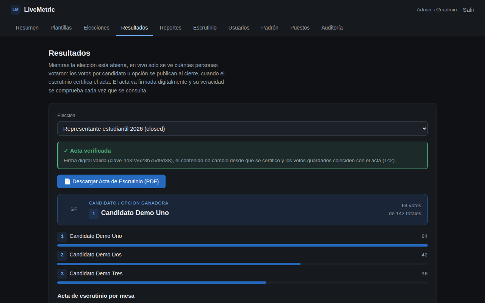

*Figura 1. Resultados certificados con el indicador de veracidad: la firma digital es válida, el acta no cambió y los votos guardados coinciden con ella.*

### 1.3 Objetivos

**Objetivo general.** Diseñar, construir, asegurar y automatizar el ciclo de vida completo de una aplicación de microservicios contenerizada, integrando controles de seguridad en cada fase, desde el modelado de amenazas hasta la detección en tiempo de ejecución.

**Objetivos específicos:**

1. Modelar las amenazas del sistema con OWASP Threat Dragon y la metodología STRIDE, y anclar cada amenaza a un flujo o proceso real del código.
2. Implementar una arquitectura de microservicios con frontend SPA, API en Node.js, un worker asíncrono, PostgreSQL y autenticación JWT con roles.
3. Contenerizar todos los componentes con imágenes mínimas, sin root y endurecidas, y publicarlas en Docker Hub con versionado semántico.
4. Automatizar en GitHub Actions un pipeline que bloquee secretos, vulnerabilidades en el código, en las dependencias, en las imágenes y en la infraestructura, y que pruebe y ataque la aplicación desplegada.
5. Desplegar la aplicación con infraestructura como código (Terraform) y orquestarla con Docker Swarm.
6. Observar la aplicación en operación con métricas, registros, alertas y detección de comportamiento anómalo.

### 1.4 Cumplimiento de los requisitos del curso

| Requisito | Cómo se cumple |
|---|---|
| Frontend SPA en React o Vue | React 18 con Vite, servido por nginx sin root |
| Backend en Node.js o Python | Cuatro microservicios Node.js 20 con Express: Auth, Voting, Analytics y Scrutiny |
| Al menos un worker | `scheduler-worker` (node-cron): abre y cierra elecciones y ordena su certificación |
| Base de datos de código abierto | PostgreSQL 16, en una red interna sin puerto hacia la PC |
| Autenticación JWT con roles | JWT HS256 con los roles `admin`, `auditor` y `voter`, verificados en cada servicio |
| Dockerfile por servicio, docker-compose | Seis Dockerfile multietapa sobre Alpine, sin root; `docker-compose.yml` para desarrollo |
| Imágenes en Docker Hub con versión semántica | Seis imágenes publicadas por `release.yml` con `1.3.3`, `v1.3.3`, `1.3` y `latest`, solo si Trivy las aprueba |
| Pipeline DevSecOps | 37 jobs en GitHub Actions, con un *Security Gate* final (sección 4) |
| IaC y orquestación | Terraform (provider `kreuzwerker/docker`) y Docker Swarm |
| Documentación en Markdown | README y manuales de arquitectura, desarrollo, despliegue, seguridad y usuario |
| Monitoreo (opcional) | Prometheus, Grafana, Loki y Falco (sección 6) |
| Licencia | MIT |

*Tabla 1. Requisitos técnicos del enunciado y su implementación.*

## 2. Arquitectura

### 2.1 Estilo arquitectónico y componentes

LiveMetric es una **arquitectura de microservicios** con seis unidades desplegables: un frontend, cuatro servicios HTTP y un worker. La descomposición sigue el dominio y no las capas técnicas: identidad, votación, analítica y escrutinio. Todo corre en contenedores Docker en una misma máquina (*Local-First*), sin depender de servicios en la nube.

| Componente | Tecnología | Responsabilidad |
|---|---|---|
| Frontend | React 18, Vite, nginx 1.27 | Interfaz de administrador, auditor y votante. Su nginx es el **único punto de entrada**: reenvía `/auth`, `/voting`, `/analytics` y `/scrutiny` |
| Auth | Node.js 20, Express | Login de administradores y auditores (usuario y contraseña) y de votantes (cédula y PIN), padrón cifrado, auditoría |
| Voting | Node.js 20, Express | Plantillas, elecciones y emisión del voto |
| Analytics | Node.js 20, Express | Resultados en vivo, reportes y verificación independiente de las actas |
| Scrutiny | Node.js 20, Express, pdfkit | Recuento independiente, cadena de hashes, firma Ed25519 y acta en PDF |
| Scheduler | Node.js 20, node-cron | Abre y cierra elecciones por horario y ordena su certificación |
| Base de datos | PostgreSQL 16 | Persistencia; `scrutiny_ledger` y `audit_log` son *append-only* |

*Tabla 2. Componentes del sistema.*

La decisión más importante de la arquitectura es que **Scrutiny sea un servicio separado de Analytics**. Si el mismo código contara los votos para la pantalla y para el acta, un error o una manipulación en esa única pieza falsearía las dos cosas sin que nada lo detectara. Separados, Scrutiny actúa como un segundo escrutador: recuenta desde los votos crudos con su propia consulta, y Analytics verifica después, por su cuenta, que el acta no cambió.

### 2.2 Diagrama de componentes

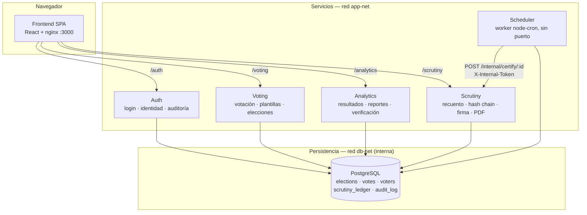

*Figura 2. Diagrama de componentes. El frontend no llega a la base; el worker es el único que habla con Scrutiny, con un token de servicio en lugar de un JWT de usuario.*

### 2.3 Diagrama de despliegue

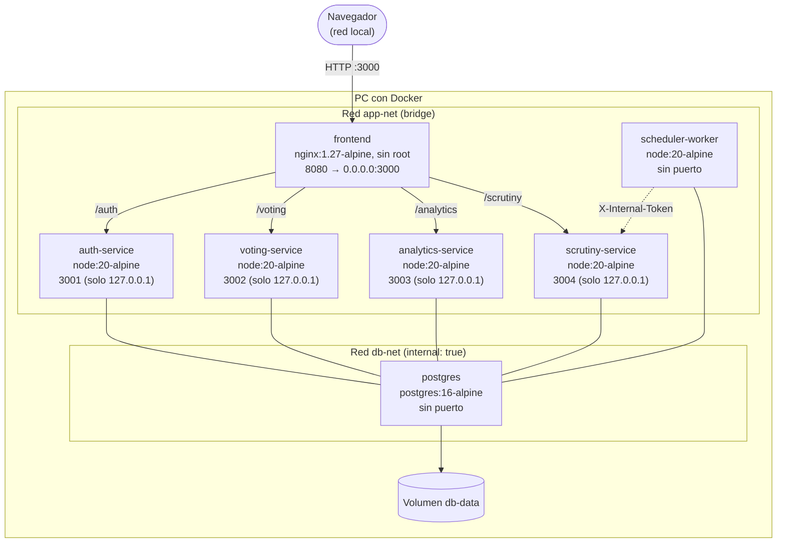

*Figura 3. Diagrama de despliegue con Docker Compose. Terraform reproduce la misma topología y Docker Swarm la despliega con réplicas y una red overlay cifrada.*

Solo el puerto 3000 del frontend se abre a la red local. Los servicios publican su puerto únicamente en `127.0.0.1` (en Swarm, ninguno), y la red `db-net` es interna: sin salida a Internet, sin acceso desde el host y sin el frontend conectado.

### 2.4 Diagramas de secuencia

El login del votante es el flujo crítico de autenticación: el votante se identifica con un dato que otros pueden conocer (su cédula), así que necesita un segundo factor que solo él tenga (el PIN), y a partir de ahí todo el sistema trabaja con una identidad seudonimizada.

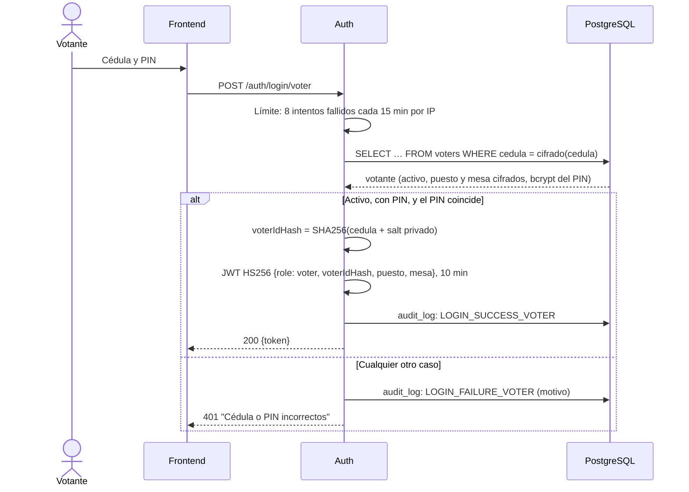

*Figura 4. Autenticación del votante. El mensaje de error es el mismo en todos los casos, para no revelar qué cédulas existen.*

El segundo flujo es el que da sentido al sistema: el cierre de una elección y la emisión de su acta.

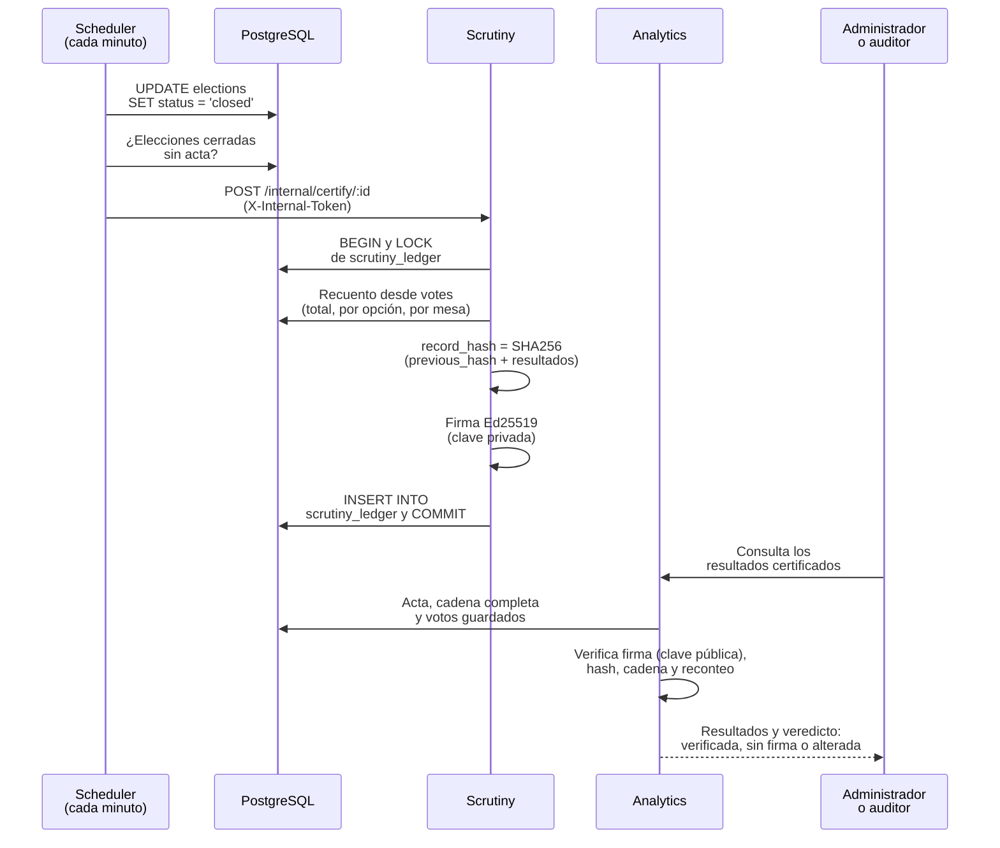

*Figura 5. Cierre y certificación de una elección. Quien firma (Scrutiny) y quien verifica (Analytics) son servicios distintos; Analytics solo tiene la clave pública.*

### 2.5 Diagrama de casos de uso

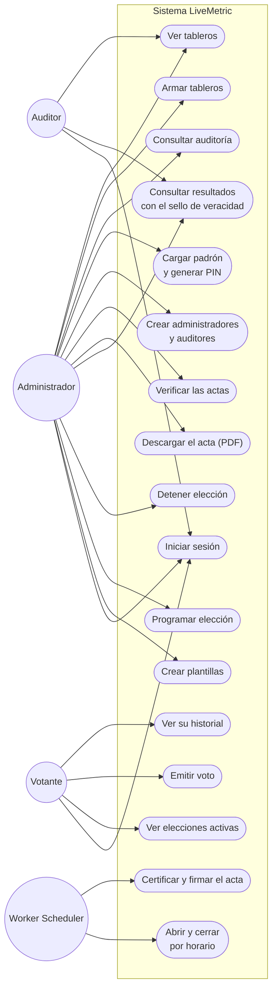

*Figura 6. Casos de uso por actor. El auditor solo lee: ningún endpoint de escritura acepta su rol.*

### 2.6 Modelo de datos

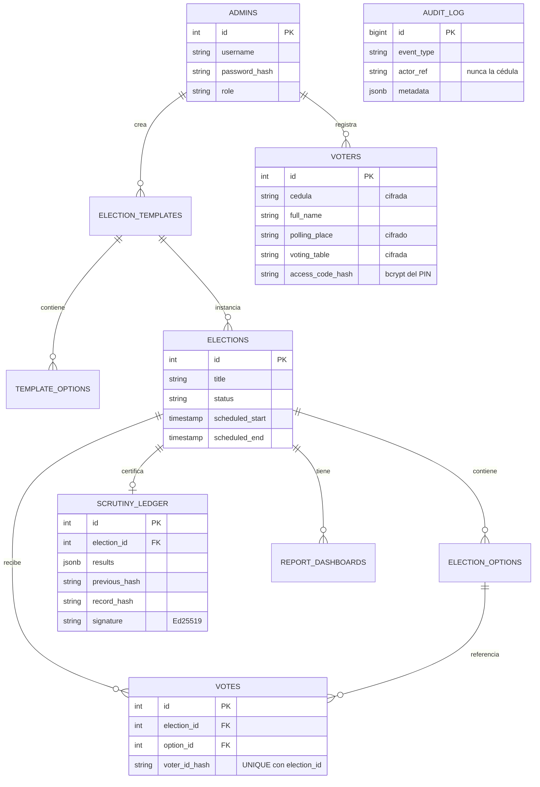

*Figura 7. Modelo de datos (resumen). `votes` nunca guarda la cédula, solo su hash con un salt que solo conoce Auth.*

### 2.7 Contenerización

Cada servicio tiene su Dockerfile multietapa sobre Alpine: una etapa instala las dependencias de producción (`npm ci --omit=dev`) y la imagen final copia solo `node_modules` y `src`. La imagen final no trae `npm` ni `corepack` (se borran, porque no hacen falta para ejecutar), aplica `apk upgrade` sobre la base y corre con un usuario propio sin privilegios. El frontend compila con Vite en la primera etapa y la imagen final es nginx con solo el `dist`, también sin root.

En ejecución, los seis contenedores de la aplicación tienen:

- el sistema de archivos **de solo lectura**, salvo un `tmpfs` en `/tmp`;
- `no-new-privileges` en compose y Terraform, y `cap_drop: ALL` en Swarm, que no soporta la opción anterior;
- un *healthcheck* propio: los servicios esperan a que la base esté sana para arrancar, y los scripts de arranque dan el sistema por listo solo cuando los siete contenedores lo están.

| Artefacto | Uso |
|---|---|
| `docker-compose.yml` | Desarrollo y ejecución local; con `docker compose watch` recarga cada servicio al cambiar su código |
| `infra/terraform/main.tf` | La misma topología como código, con el provider `kreuzwerker/docker` |
| `orquestacion/docker-stack.yml` | Docker Swarm: réplicas, *rolling update* con *rollback* automático, límites de recursos y red overlay cifrada |
| `infra/contenedor-global/` | Un contenedor con Docker adentro, para levantar todo sin instalar nada en la PC |

*Tabla 3. Formas de desplegar el sistema.*

### 2.8 Arquitectura del pipeline DevSecOps

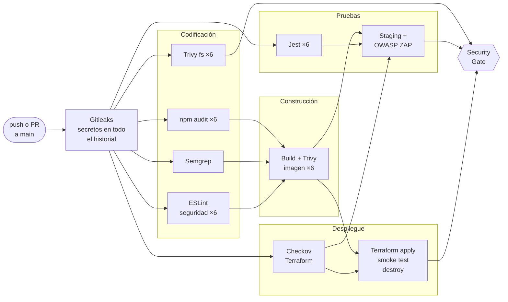

*Figura 8. Pipeline de `devsecops.yml`, que corre en cada push y pull request a `main`. Gitleaks va primero: si encuentra un secreto, no corre nada más. El Security Gate espera a todos los controles, no solo a los que se dibujan llegando a él. Aparte, la insignia de cobertura se publica después de Jest.*

La publicación es un pipeline aparte (`release.yml`), que corre solo al crear un tag `vX.Y.Z`. Así, `latest` no cambia con cada commit, sino solo cuando el equipo publica una versión:

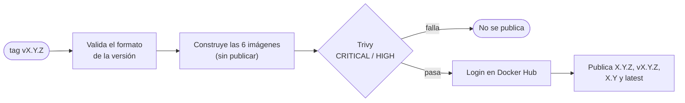

*Figura 9. Pipeline de publicación. Las credenciales de Docker Hub se usan después del escaneo: si la imagen no lo pasa, el runner nunca las toca.*

### 2.9 Decisiones de diseño principales

| Decisión | Alternativa descartada | Motivo |
|---|---|---|
| Scrutiny separado de Analytics | Calcular el acta en Analytics | Un solo cálculo comprometido falsearía pantalla y acta a la vez |
| Anti doble voto con `UNIQUE(election_id, voter_id_hash)` | Huella de IP y navegador | La identidad, no el dispositivo, es lo que se debe limitar; la base lo garantiza aunque haya carreras |
| Firma Ed25519 además de la cadena de hashes | Solo la cadena | La cadena no usa secretos: quien pueda escribir en la base podría rehacerla completa |
| JWT de votante de 10 minutos, en memoria | El mismo JWT de una hora del administrador, en `localStorage` | Un puesto de votación es un equipo compartido |
| Worker independiente con node-cron | Un temporizador dentro de Voting | Una caída de Voting no debe congelar los cierres |
| Base de datos compartida entre servicios | Una base por servicio | Las invariantes críticas necesitan una sola transacción; se acepta como deuda técnica |
| Cada instalación genera su propio `.env` | Credenciales compartidas o una base en la nube | No hay secretos que distribuir, rotar entre personas ni filtrar |

*Tabla 4. Decisiones de diseño (el registro completo está en el manual de arquitectura).*

## 3. Modelado de amenazas

### 3.1 Metodología

El modelo se construyó con **OWASP Threat Dragon 2.6.2** y la metodología **STRIDE por elemento**: cada proceso, almacén y flujo de datos de los diagramas se revisó contra las seis categorías (suplantación, manipulación, repudio, divulgación de información, denegación de servicio y elevación de privilegios). El modelo formal está versionado en el repositorio (`docs/threat-model/livemetric.threatdragon.json`), valida contra el esquema oficial de Threat Dragon y se abre en la herramienta. Las Figuras 10 y 11 son sus diagramas, exportados desde la propia herramienta.

Tres reglas guiaron el trabajo:

1. **Cada amenaza se ancla a un elemento real**: un flujo, proceso o almacén que existe en el código, no un ejemplo genérico.
2. **Cada mitigación cita el control implementado**, con el archivo donde está.
3. **Lo que no se mitiga se dice**: el estado puede ser *mitigado*, *mitigado parcial* o *aceptado*, y en los dos últimos se explica el riesgo residual.

Las líneas punteadas de los diagramas son **fronteras de confianza**: la red donde corren los servicios y la red interna de la base. El flujo en rojo es el único con una amenaza abierta, aceptada por diseño.

### 3.2 Diagramas de flujo de datos

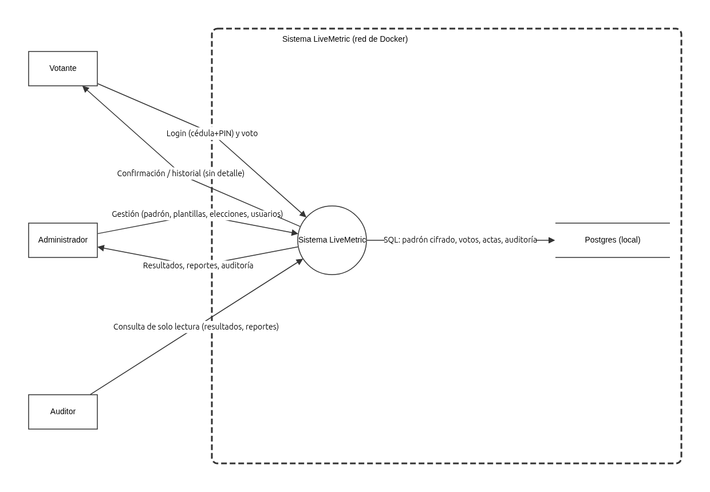

*Figura 10. DFD de nivel 0 (contexto), exportado de OWASP Threat Dragon.*

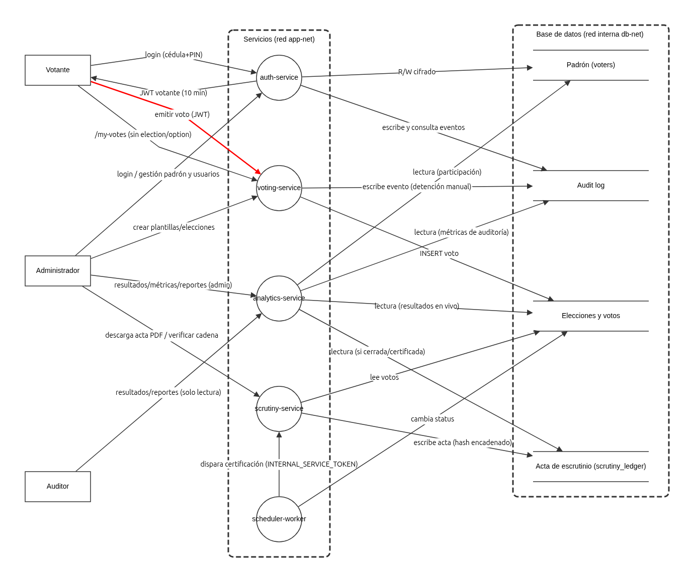

*Figura 11. DFD de nivel 1 (por microservicio), exportado de OWASP Threat Dragon.*

### 3.3 Amenazas identificadas por categoría STRIDE

| # | Elemento | Amenaza | Estado | Contramedida |
|---|---|---|---|---|
| **S** | **Suplantación** | | | |
| 1 | Votante → Auth (login) | Alguien que conoce la cédula de un votante intenta suplantarlo | Mitigado | Cédula **y** PIN de 6 dígitos generado por el administrador, guardado con bcrypt |
| 8 | Scheduler → Scrutiny | Un servicio no autorizado ordena certificar una elección | Mitigado | Token interno, comparado en tiempo constante (`timingSafeEqual`), que nunca llega al navegador |
| 15 | Acta (`scrutiny_ledger`) | Insertar un acta que Scrutiny nunca emitió | Mitigado | Firma Ed25519: sin la clave privada no se puede fabricar un acta válida |
| **T** | **Manipulación** | | | |
| 4 | Auth ↔ Padrón | Alterar la cédula, el puesto o la mesa de un votante en la base | Mitigado (parcial) | AES-256-GCM a nivel de aplicación. Residual: el nonce es determinístico para poder buscar por cédula, así que se nota si dos filas cifran igual |
| 7 | Voting (`/vote`) | Votar fuera del horario o después de un cierre manual | Mitigado | Cada voto valida `status = 'active'` y la ventana de tiempo |
| 9 | Acta (`scrutiny_ledger`) | Cambiar un acta certificada | Mitigado | Tabla *append-only* (un trigger rechaza `UPDATE` y `DELETE`) y cadena de hashes |
| 15 | Acta (`scrutiny_ledger`) | Saltarse el trigger y **recalcular toda la cadena** | Mitigado | La firma no se puede rehacer sin la clave privada: el indicador de veracidad muestra el acta como **alterada** |
| **R** | **Repudio** | | | |
| 3 | Votante → Voting (voto) | El votante niega haber votado, o niega por quién votó | **Aceptado** | Por diseño: el sistema registra que el voto ocurrió (`voter_id_hash`), pero no lo liga a la identidad real. Es el costo del secreto del voto |
| 10 | Audit log | Borrar o cambiar un evento para ocultar un incidente | Mitigado | Tabla *append-only*, igual que las actas |
| **I** | **Divulgación de información** | | | |
| 5 | Auth ↔ Padrón | Una fuga de la base expone la identidad de los votantes | Mitigado | Cédula, puesto y mesa cifrados; el nombre queda legible a propósito, para gestionar el padrón |
| 12 | Navegador → frontend | Exponer cuatro servicios en puertos sueltos | Mitigado | nginx como único punto de entrada; los servicios, solo en `127.0.0.1` |
| 13 | Credenciales (`.env`) | El archivo con todos los secretos se filtra | Mitigado | Cada instalación genera el suyo, con permisos 600; nunca entra al repositorio ni a una imagen |
| **D** | **Denegación de servicio** | | | |
| 2 | Votante → Auth (login) | Fuerza bruta sobre el PIN | Mitigado | 8 intentos **fallidos** cada 15 minutos por IP (los correctos no cuentan, para no bloquear un puesto con un solo equipo) y reporte de accesos sospechosos |
| **E** | **Elevación de privilegios** | | | |
| 6 | Voting (`/vote`) | Votar más de una vez en la misma elección | Mitigado | `UNIQUE(election_id, voter_id_hash)` en la base, dentro de una transacción |
| 11 | Admin/Auditor → Analytics | Un auditor crea, edita o borra un tablero | Mitigado | `requireRole('admin')` en cada endpoint de escritura |
| 14 | Frontend → PostgreSQL | Desde el frontend comprometido, conectarse a la base | Mitigado | La base está en `db-net` (interna), donde el frontend no está conectado |

*Tabla 5. Las 15 amenazas del modelo, agrupadas por categoría STRIDE (la 15 aparece en dos categorías).*

### 3.4 Contramedidas implementadas

Las contramedidas se refuerzan entre sí: ninguna amenaza grave depende de un solo control.

- **Integridad del acta, en cuatro capas.** El trigger *append-only* impide cambiarla; la cadena de hashes delata un cambio suelto; la firma Ed25519 delata a quien rehace toda la cadena. Además, Analytics recuenta los votos guardados y los compara con el acta. La Figura 12 muestra el resultado de esa verificación en la interfaz.
- **Identidad del votante.** La cédula viaja al servidor una vez, en el login. Desde ahí, el sistema usa solo su hash con un salt privado de Auth, y en la base queda cifrada.
- **Aislamiento de red.** Hay un solo puerto abierto a la red (3000), la base está en una red interna y el frontend no llega a ella.
- **Mínimo privilegio en los contenedores.** Corren sin root, con el sistema de archivos de solo lectura y sin poder ganar privilegios; Falco vigila que siga así en ejecución (sección 6).
- **Secretos por instalación.** Cada instalación genera sus propios secretos: no hay credenciales compartidas en el repositorio, en las imágenes ni en el pipeline, que genera las suyas en cada corrida.

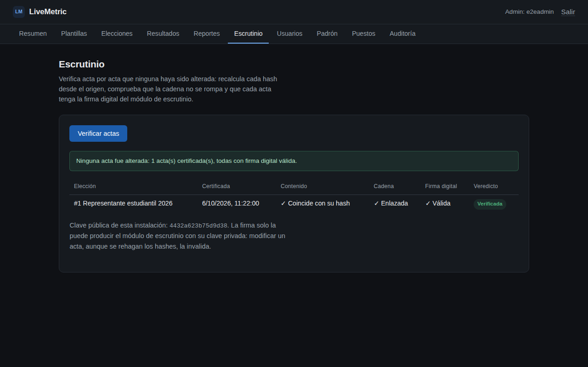

*Figura 12. Verificación de todas las actas: contenido contra su hash, enlace con la anterior y firma digital, con un veredicto por acta.*

### 3.5 Alcance y riesgos residuales

- **Quien tenga el `.env` tiene la clave privada de firma** y podría firmar un acta falsa. Por eso esa clave vive solo en ese archivo y en el contenedor de Scrutiny.
- **El modelo no cubre la máquina anfitriona.** Quien controle su sistema operativo o su motor de Docker controla la instalación.
- **El stack de monitoreo está fuera de las fronteras del modelo.** Publica sus puertos solo en `127.0.0.1` y no llega a la base, pero lee los registros de todos los contenedores, y dos de sus componentes corren en modo privilegiado (sección 6.5).

## 4. Implementación del pipeline

### 4.1 Visión general

El pipeline sigue el enfoque *shift-left*: los controles corren en cada push y en cada pull request a `main`, antes de que el cambio llegue a una versión publicada. Su configuración aplica varias prácticas de seguridad propias de la cadena de suministro:

- **Permisos mínimos.** El workflow declara `contents: read` como permiso por defecto. Solo los jobs que suben resultados a GitHub Security reciben `security-events: write`.
- **Actions fijadas a un commit.** Todas las actions de terceros están fijadas al SHA de un commit, con la versión como comentario. Un tag puede moverse; un SHA, no.
- **Herramientas libres, invocadas directamente.** Gitleaks y Semgrep se invocan con su imagen oficial en lugar de sus actions: la de Gitleaks ahora exige una licencia de pago, y la de Semgrep nunca generaba el SARIF.
- **Resultados en un solo lugar.** Los hallazgos de Semgrep, ESLint, Trivy y Checkov se suben en formato SARIF a *Security → Code scanning*.
- **Sin secretos del repositorio.** Las pruebas, el despliegue con Terraform y el entorno de DAST generan sus propios secretos aleatorios y su propia base, que se destruyen al terminar. Ningún job puede tocar los datos de una instalación real.

```yaml
permissions:
  contents: read            # por defecto, para todo el workflow

jobs:
  secrets-scan:             # 1) primero: si falla, nada más corre
    steps:
      - uses: actions/checkout@11d5960a326750d5838078e36cf38b85af677262 # v4.4.0
        with:
          fetch-depth: 0    # todo el historial, no solo el último commit
      - run: |
          docker run --rm -v "${{ github.workspace }}:/repo" zricethezav/gitleaks:latest \
            detect --source /repo --config /repo/.gitleaks.toml --redact --verbose
```

*Fragmento 1. Encabezado del workflow y job de Gitleaks (`.github/workflows/devsecops.yml`).*

### 4.2 Fase 1 — Planificación

El modelo de amenazas de la sección 3 es el insumo de las fases siguientes: cada control del pipeline responde a una amenaza del modelo. Cuando se agrega una funcionalidad con un flujo de datos nuevo, el flujo se agrega a los DFD y se revisa contra las seis categorías STRIDE, en el modelo de Threat Dragon y en la tabla.

### 4.3 Fase 2 — Codificación

| Job | Herramienta | Qué detiene | ¿Bloquea? |
|---|---|---|---|
| `secrets-scan` | **Gitleaks** | Secretos en el código y en todo el historial de git. También corre antes de cada commit, con un hook (`scripts/git-hooks/pre-commit`) | Sí, y detiene el resto |
| `sast-scan` | **Semgrep** | Reglas `p/owasp-top-ten`, `p/expressjs`, `p/nodejsscan` y `p/jwt`: inyección, JWT, configuraciones inseguras de Express | No: reporta |
| `lint-security` | **ESLint** + `eslint-plugin-security` | En los 6 servicios: `eval`, `child_process`, ReDoS, rutas y claves armadas con datos, comparaciones sin tiempo constante. En el frontend, además: `dangerouslySetInnerHTML`, `innerHTML`, URLs `javascript:` y `target="_blank"` sin `rel` | Sí, con cualquier hallazgo |
| `dependency-audit` | **npm audit** | CVE en las dependencias de producción, desde severidad alta | Sí |
| `sca-scan` | **Trivy** (`fs`) | CVE críticas o altas en `package-lock.json` | Sí |

*Tabla 6. Controles de la fase de codificación.*

El enunciado menciona Bandit, que analiza código Python. LiveMetric está escrito en Node.js, así que ese análisis lo hacen Semgrep y ESLint con reglas de seguridad. ESLint bloquea con cualquier hallazgo, y un falso positivo solo pasa con una excepción escrita en la misma línea y su motivo. Hoy hay 11, todas de `detect-object-injection`: índices numéricos de arreglos o claves que salen de listas fijas del propio código.

```yaml
      - name: Quitar del SARIF los hallazgos silenciados con nosemgrep
        run: |
          jq '(.runs[].results) |= map(select((.suppressions // []) | length == 0))' semgrep.sarif > semgrep.filtrado.sarif
          mv semgrep.filtrado.sarif semgrep.sarif
      ...
      - name: ESLint (bloquea con cualquier hallazgo)
        working-directory: services/${{ matrix.service }}
        run: npx eslint . --max-warnings 0
```

*Fragmento 2. GitHub no respeta la marca de "suprimido" de herramientas externas: los hallazgos con una excepción justificada en el código se quitan del SARIF, para que Code scanning muestre solo lo que falta revisar.*

### 4.4 Fase 3 — Integración y construcción

El job `container-scan` construye las seis imágenes reales, igual que en producción, y las escanea con Trivy. Una CVE crítica o alta con corrección disponible detiene el pipeline. Las excepciones irían en `.trivyignore` con su justificación; hoy no hay ninguna.

```yaml
  container-scan:
    needs: [dependency-audit, sast-scan, lint-security]
    strategy:
      matrix:
        service: [auth, voting, analytics, scrutiny, scheduler, frontend]
    steps:
      - run: docker build -t livemetric/${{ matrix.service }}-service:ci ./services/${{ matrix.service }}
      - uses: aquasecurity/trivy-action@ed142fd0673e97e23eac54620cfb913e5ce36c25 # v0.36.0
        with:
          image-ref: 'livemetric/${{ matrix.service }}-service:ci'
          severity: 'CRITICAL,HIGH'
          exit-code: '1'
          ignore-unfixed: true
```

*Fragmento 3. Escaneo de las imágenes.*

### 4.5 Fase 4 — Pruebas

**Pruebas unitarias y de integración.** Jest corre en los seis componentes: **263 pruebas** en la corrida sobre la v1.3.3.

- **Servicios.** Supertest llama a la app de Express en memoria contra un PostgreSQL 16 real y desechable: cada `npm test` lo levanta en un contenedor, le carga `db/init.sql` y lo borra al terminar.
- **Frontend.** React Testing Library prueba los componentes sobre jsdom, con el cliente HTTP reemplazado por un doble.

Entre las pruebas hay ataques simulados. Por ejemplo, un acta reescrita con todos los hashes recalculados tiene que verse como alterada, porque su firma deja de corresponder. La cobertura de líneas se publica en GitHub Pages y alimenta la insignia del README.

```yaml
  unit-tests:
    strategy:
      matrix:
        service: [auth, voting, analytics, scrutiny, scheduler, frontend]
    steps:
      - run: npm ci --ignore-scripts
      - run: npm test -- --coverage --coverageReporters=json-summary --coverageReporters=text-summary
```

*Fragmento 4. Pruebas con cobertura.*

**DAST.** El job `staging-deploy-and-dast` levanta el stack completo, con un `.env` generado como en una instalación nueva, y ataca el frontend con **OWASP ZAP** en modo *baseline* (pasivo, con reglas alfa). El reporte HTML queda como artefacto de la corrida. Es un control de **reporte**, no bloqueante: sus hallazgos se revisan uno por uno (sección 5).

### 4.6 Fase 5 — Despliegue

| Job o workflow | Herramienta | Qué hace |
|---|---|---|
| `iac-scan` | **Checkov** | Revisa `infra/terraform/main.tf` con seis políticas propias (ver abajo). Bloquea |
| `iac-deploy` | **Terraform** | `terraform apply` levanta el sistema completo, un *smoke test* comprueba que los cuatro servicios responden, y `terraform destroy` lo limpia |
| `release.yml` | **Trivy** + Docker Hub | Publica las seis imágenes solo si pasan el escaneo (Figura 9) |
| `orquestacion/deploy.sh` | **Docker Swarm** | Despliega la versión publicada, después de verificar que las seis imágenes existen en Docker Hub |

*Tabla 7. Controles y automatización del despliegue.*

Checkov no trae controles para el provider `kreuzwerker/docker`: sobre `main.tf` no evaluaba ningún recurso, y el job pasaba en verde sin haber revisado nada. Se detectó al preparar este informe. La corrección fueron **seis políticas propias** (`infra/terraform/politicas-checkov/`), que escriben en código lo que promete la arquitectura:

1. la red de la base es interna;
2. los contenedores solo publican puertos en `127.0.0.1`;
3. la base no publica ningún puerto;
4. cada contenedor tiene el sistema de archivos de solo lectura;
5. cada contenedor corre con `no-new-privileges`;
6. ningún contenedor corre en modo privilegiado.

Al activarlas aparecieron 14 fallas: los contenedores de Terraform no tenían el endurecimiento del compose. Se corrigieron en `main.tf` y se probaron con un `terraform apply` real.

```yaml
metadata:
  id: "CKV2_LM_1"
  name: "La red de la base de datos debe ser interna"
  severity: "HIGH"
definition:
  or:
    - { cond_type: attribute, resource_types: [docker_network], attribute: name, operator: not_contains, value: db }
    - { cond_type: attribute, resource_types: [docker_network], attribute: internal, operator: equals, value: true }
```

*Fragmento 5. Una de las políticas propias de Checkov (`red-base-interna.yaml`).*

```yaml
      - name: Calcular etiquetas y metadatos
        uses: docker/metadata-action@c299e40c65443455700f0fdfc63efafe5b349051 # v5.10.0
        with:
          tags: |
            type=semver,pattern={{version}},value=${{ needs.version.outputs.semver }}
            type=raw,value=${{ needs.version.outputs.semver }}
            type=semver,pattern={{major}}.{{minor}},value=${{ needs.version.outputs.semver }}
            type=raw,value=latest
```

*Fragmento 6. Etiquetas de cada imagen publicada (`release.yml`): `1.3.3`, `v1.3.3`, `1.3` y `latest`.*

### 4.7 Fase 6 — Operación y monitoreo

Con la aplicación desplegada, Prometheus, Grafana y Loki la observan, y Falco detecta comportamiento anómalo dentro de los contenedores. Se describe en la sección 6.

### 4.8 Security Gate y pipeline local

El último job, `security-gate`, espera a todos los controles, escribe un resumen con el resultado real de cada uno y falla si alguno falló. Es el *check* requerido recomendado para proteger `main`.

```yaml
      - name: Verificar que todos los controles pasaron
        run: |
          if [ "${{ contains(needs.*.result, 'failure') }}" = "true" ]; then
            echo "❌ QUALITY GATE NO SUPERADO. Uno o mas controles de seguridad fallaron. Bloqueando merge."
            exit 1
          fi
```

*Fragmento 7. El Security Gate.*

Los mismos controles, salvo Checkov, Terraform y ZAP, corren en la PC con `./scripts/pipeline-local.sh` (o su equivalente `.bat` en Windows) en unos cinco minutos, con cada resultado ya interpretado. El script de arranque del sistema lo ejecuta antes de levantar el stack: si algo bloqueante falla, no arranca.

## 5. Resultados de seguridad

### 5.1 Resumen de la última corrida

Los datos de esta sección salen de la corrida del pipeline sobre la versión v1.3.3, del 29 de septiembre de 2026, y del pipeline local sobre ese mismo código.

| Control | Resultado |
|---|---|
| Gitleaks | Sin secretos en los 68 commits del historial |
| Semgrep | 289 reglas sobre 185 archivos: 0 hallazgos de severidad alta o media; 33 informativos |
| ESLint | 0 hallazgos en los 6 servicios; 11 excepciones justificadas en el código |
| npm audit | 0 vulnerabilidades en las dependencias de producción de los 6 servicios |
| Trivy (dependencias) | 0 CVE críticas o altas |
| Trivy (imágenes) | 0 CVE críticas o altas en las 6 imágenes |
| Checkov | 37 controles aprobados, 0 fallidos |
| Jest | 263 pruebas aprobadas; 78,5 % de cobertura de líneas |
| Terraform | Despliegue, *smoke test* y destrucción correctos |
| OWASP ZAP | 0 alertas altas, 0 medias, 1 baja (falso positivo) y 9 informativas |

*Tabla 8. Resultado de cada control.*

### 5.2 Reportes de ejemplo

**Pipeline local.** Este es el cuadro final de `./scripts/pipeline-local.sh`, que resume todos los controles por servicio:

```
  Todo el repositorio
   ✔ Secretos  · Gitleaks    sin secretos expuestos (68 commits revisados)
   ✔ Código    · Semgrep     sin hallazgos para revisar · 33 informativos

  Por servicio Código     Dependencias          Imagen Docker         Pruebas
              ESLint     npm audit  Trivy      build      Trivy      Jest
  auth        ✔          ✔          ✔          ✔          ✔          ✔ 21
  voting      ✔          ✔          ✔          ✔          ✔          ✔ 33
  analytics   ✔          ✔          ✔          ✔          ✔          ✔ 84
  scrutiny    ✔          ✔          ✔          ✔          ✔          ✔ 20
  scheduler   ✔          ✔          ✔          ✔          ✔          ✔ 4
  frontend    ✔          ✔          ✔          ✔          ✔          ✔ 101

  ✔ Todos los controles que bloquean pasaron. Es seguro hacer push.
```

**Gitleaks.** Revisa el historial completo con las reglas por defecto, más una propia para `JWT_SECRET`. Cuatro huellas de falsos positivos ya revisados están en `.gitleaksignore`, cada una con su motivo: una contraseña deliberadamente incorrecta en una prueba y los ejemplos de la documentación que muestran cómo comprobar que Gitleaks bloquea.

```
INF 68 commits scanned.
INF scanned ~2685067 bytes (2.69 MB) in 1.16s
INF no leaks found
```

**Semgrep.** Los 33 hallazgos que quedan son informativos, en siete categorías, y confirman protecciones que están implementadas. Por ejemplo, `helmet_header_x_powered_by` (9 casos) indica que helmet quita la cabecera `X-Powered-By`, y `rate_limit_control` (4) que los servicios limitan la tasa de peticiones. Los 28 hallazgos altos y medios de las primeras corridas se corrigieron todos (Tabla 10).

```
Ran 289 rules on 185 files: 33 findings.
[INFO] helmet_header_x_powered_by (9)
[INFO] rate_limit_control (4)
[INFO] helmet_header_dns_prefetch (4)   [INFO] helmet_header_hsts (4)
[INFO] helmet_header_ienoopen (4)       [INFO] helmet_header_nosniff (4)
[INFO] helmet_header_xss_filter (4)
```

**Trivy.** El resumen de una de las imágenes: el sistema base (Alpine) y cada paquete de Node.js, sin vulnerabilidades críticas ni altas.

```
│ livemetric-auth-localcheck (alpine 3.23.4)            │  alpine  │  0  │
│ app/node_modules/express/package.json                 │ node-pkg │  0  │
│ app/node_modules/jsonwebtoken/package.json            │ node-pkg │  0  │
│ app/node_modules/pg/package.json                      │ node-pkg │  0  │
│ …                                                     │          │     │
Legend: '0': Clean (no security findings detected)
```

**Checkov.**

```
terraform scan results:
Passed checks: 37, Failed checks: 0, Skipped checks: 0
```

**OWASP ZAP.** La Figura 13 es el resumen del reporte de la última corrida. La única alerta baja, *Timestamp Disclosure*, es un falso positivo: ZAP interpreta como marca de tiempo una constante numérica del JavaScript compilado de una librería (`1604231423`).

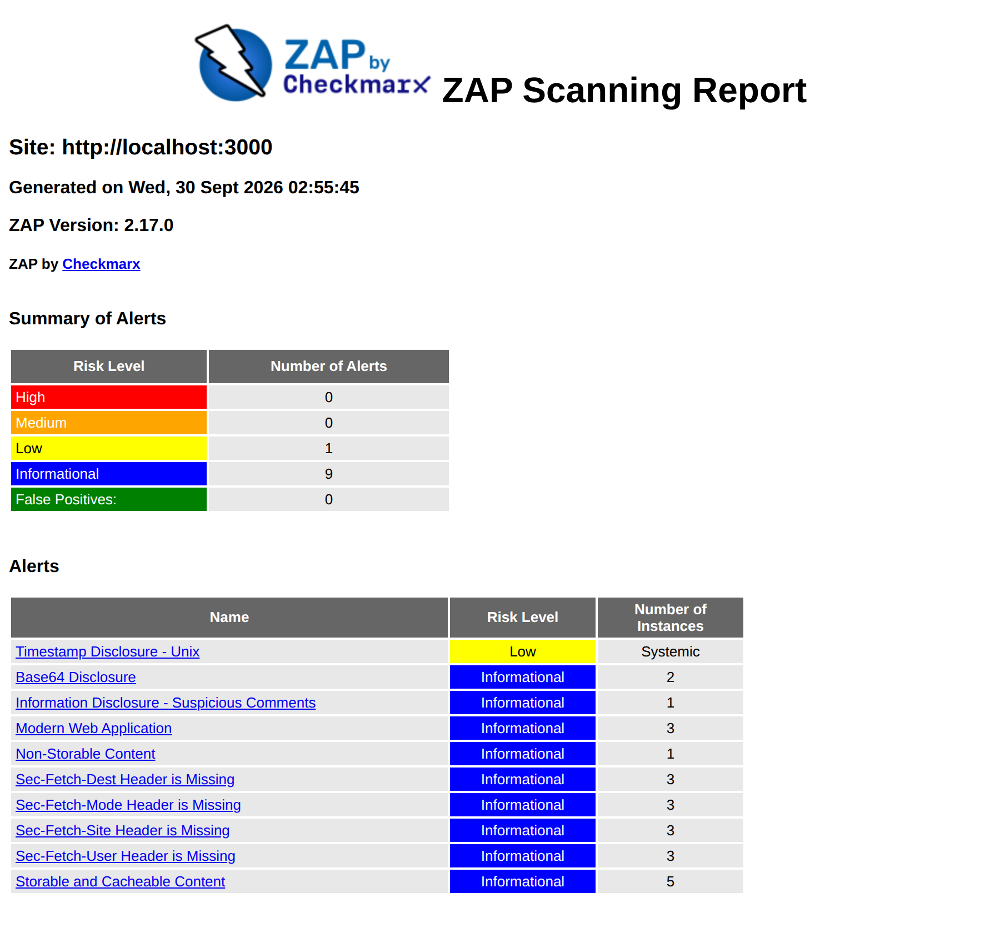

*Figura 13. Resumen del reporte de OWASP ZAP sobre `http://localhost:3000`.*

La evolución de ZAP muestra el ciclo completo de gestión de un hallazgo:

| Corrida | Altas | Medias | Bajas | Informativas |
|---|---|---|---|---|
| Primera corrida con el stack completo | 0 | 1 | 7 | 9 |
| Después de corregir las cabeceras | 0 | 0 | 1 | 9 |

*Tabla 9. Alertas de ZAP antes y después de las correcciones.*

**Pruebas y cobertura.**

| Componente | Pruebas | Líneas cubiertas | Cobertura |
|---|---|---|---|
| Analytics | 84 | 481 / 520 | 92,5 % |
| Scrutiny | 20 | 320 / 358 | 89,4 % |
| Voting | 33 | 159 / 204 | 77,9 % |
| Frontend | 101 | 586 / 775 | 75,6 % |
| Auth | 21 | 173 / 315 | 54,9 % |
| Scheduler | 4 | 26 / 52 | 50,0 % |
| **Total** | **263** | **1745 / 2224** | **78,5 %** |

### 5.3 Tabla de hallazgos

Un hallazgo no siempre sale de una herramienta automática: algunos aparecieron al diseñar, al probar el despliegue o al revisar si un control hacía lo que decía. Todos siguen el mismo proceso:

1. **Triage.** ¿Es real y explotable en LiveMetric?
2. **Decisión.** Corregir siempre que se pueda; mitigar con un control compensatorio documentado; o aceptar, solo con una justificación escrita.
3. **Registro.** Todo queda anotado en el documento *Decisiones y riesgos* del repositorio.

| Hallazgo | Origen | Severidad | Estado | Justificación |
|---|---|---|---|---|
| El login de votante usaba la cédula como usuario y como contraseña | Diseño | Alta | Resuelto | Ahora es cédula y un PIN de 6 dígitos, en bcrypt, que genera el administrador y se muestra una sola vez |
| Conexión TLS a la base sin verificar el certificado, AES-GCM sin largo de etiqueta fijo, nginx con el proceso maestro como root, cabecera `Host` del cliente reenviada, `Math.random()` para identificadores, 17 actions fijadas por tag mutable y una contraseña fija en una prueba | Semgrep (28 hallazgos) | Alta y media | Resuelto | Certificado verificado (después la base pasó a ser local, en una red interna); etiqueta GCM de 16 bytes; nginx sin root; `Host` fijo; ids con Web Crypto; actions fijadas a SHA; contraseña aleatoria por corrida |
| Credenciales fijas del administrador y del padrón de demostración en `db/init.sql` | Revisión | Media | Resuelto | El repositorio no trae ninguna credencial: el primer administrador se crea con un script que pide la contraseña |
| Content-Security-Policy ausente | ZAP | Media | Resuelto | CSP estricta: scripts y conexiones solo del propio origen; el único `<style>` en línea permitido se autoriza por su hash |
| `X-Content-Type-Options` ausente en `/config.js`; COEP, COOP, CORP y Permissions-Policy ausentes; nginx revelaba su versión | ZAP | Baja | Resuelto | Cabeceras en `cabeceras-seguridad.conf`, incluidas también en el `location` de `/config.js`; `server_tokens off` |
| *Timestamp Disclosure* | ZAP | Baja | Aceptado | Falso positivo: una constante numérica de una librería |
| 9 alertas informativas (*Modern Web Application*, *Sec-Fetch-\**, *Storable Content*, *Base64 Disclosure*, *Suspicious Comments*) | ZAP | Informativa | Aceptado | Describen la aplicación o señalan comentarios y cadenas Base64 dentro de las librerías compiladas; ninguna es una falla explotable |
| 33 hallazgos informativos | Semgrep | Informativa | Aceptado | Confirman controles implementados (helmet, rate limiting) |
| El `Dockerfile` del contenedor global corre como root | Semgrep | Media | Aceptado | Ese contenedor ejecuta su propio motor de Docker, que necesita root; excepción `nosemgrep` con el motivo en la línea |
| El frontend hablaba directamente con cada servicio, y cada uno validaba CORS por su cuenta | Revisión | Baja | Resuelto | nginx como único punto de entrada; los servicios solo en `127.0.0.1` |
| Checkov no evaluaba ningún recurso de Terraform | Revisión del pipeline | Media | Resuelto | Seis políticas propias; cada una se probó rompiendo lo que protege |
| Los contenedores de Terraform no tenían solo lectura ni `no-new-privileges` | Checkov (políticas propias) | Media | Resuelto | `main.tf` los declara igual que el compose; probado con `apply` y `destroy` |
| En Swarm, el API quedaba publicado en todas las interfaces y `no-new-privileges` se ignoraba | Prueba de despliegue | Media | Resuelto | Solo se publica el 3000; los servicios corren con `cap_drop: ALL` |
| El límite de intentos del login contaba también los ingresos correctos, y un puesto con un solo equipo se bloqueaba | Revisión | Media (disponibilidad) | Resuelto | Solo cuentan los intentos fallidos; hay una prueba que reproduce el caso del puesto |
| El votante puede negar haber votado (repudio) | Modelo de amenazas | — | Aceptado | Por diseño: preservar el secreto del voto |
| Nonce determinístico en el cifrado del padrón | Modelo de amenazas | Baja | Mitigado (parcial) | Necesario para buscar por cédula; no revela el valor |
| La base no tiene respaldo automático | Análisis de riesgos | Media | Aceptado | Respaldo manual documentado (`pg_dump` más una copia del `.env`) |
| En Swarm, los secretos viajan como variables de entorno | Análisis de riesgos | Baja | Aceptado | Pendiente: `docker secret` (sección 7.4) |
| esbuild, dependencia de Vite 5, permite leer el servidor de desarrollo desde otro sitio | npm audit (incluyendo desarrollo) | Media | Aceptado temporalmente | Solo afecta a `npm run dev`; producción sirve archivos estáticos con nginx. Pendiente: actualizar Vite |
| cAdvisor y Falco corren en modo privilegiado | Diseño del monitoreo | Media | Aceptado | Inherente a su función; el monitoreo está en un compose aparte y sus puertos, solo en `127.0.0.1` |
| Sin el binario de Gitleaks instalado, el hook de pre-commit dejaba pasar cualquier commit | Prueba del hook | Media | Resuelto | Usa la imagen de Docker de Gitleaks (el proyecto solo exige Docker); un error de la herramienta no bloquea el commit, un secreto sí |
| Los servicios se conectan a la base como dueños de las tablas, y por eso pueden desactivar el trigger *append-only* | Demostración del ataque a las actas | Media | Mitigado | La firma Ed25519 y el reconteo detectan cualquier alteración del acta (Figura 16). Pendiente: un usuario de base por servicio, sin permiso para cambiar las tablas |

*Tabla 10. Hallazgos con su severidad, estado y justificación.*

### 5.4 Cómo se comprueba que los controles bloquean

Un control que nunca falla puede no estar revisando nada: lo demostró Checkov. Por eso cada control se prueba **rompiendo a propósito** lo que protege. El manual del pipeline documenta un procedimiento para cada herramienta: un secreto en un commit, una dependencia con CVE conocidas, una consulta SQL concatenada, una imagen base antigua, entre otros. En este trabajo se verificó en particular:

- **Checkov.** Cada una de las seis políticas se probó con una copia de `main.tf` que rompe exactamente lo que ella protege. En los seis casos falló solo esa política, sobre el recurso correcto.
- **Pruebas del frontend.** Se introdujeron 21 defectos en el código: por ejemplo, el sello del acta en verde sin firma, la sesión guardada en `localStorage` o un nombre de candidato interpretado como HTML. Las pruebas detectaron los 21; dos de ellas hubo que reforzarlas antes.
- **CSP.** Se recorrió toda la aplicación con un navegador registrando cada violación de la política: no hubo ninguna. Un script inyectado a propósito quedó bloqueado.
- **Hook de pre-commit.** Con un secreto de prueba preparado, el hook bloqueó el commit. Esa prueba mostró que, sin el binario de Gitleaks instalado, el hook dejaba pasar todo. Ahora usa la imagen de Docker de Gitleaks, la misma del pipeline.
- **Integridad del acta, en vivo (amenaza 15).** Un script de demostración (`scripts/demo/alterar-acta.js`) hace lo que haría un atacante con acceso total a la base:
  - intenta cambiar el acta y la base se lo impide;
  - con permisos de dueño de la tabla, apaga el trigger *append-only*;
  - da vuelta el resultado;
  - recalcula todos los hashes, para que la cadena vuelva a cuadrar.

  El sistema la marcó como **alterada** de inmediato (Figura 16). La firma no se puede rehacer sin la clave privada, y el reconteo de los votos guardados no coincide con el acta. El script corre en el contenedor de Analytics, que tiene la base y el código pero solo la clave pública; es la demostración de la historia de usuario de la sustentación.

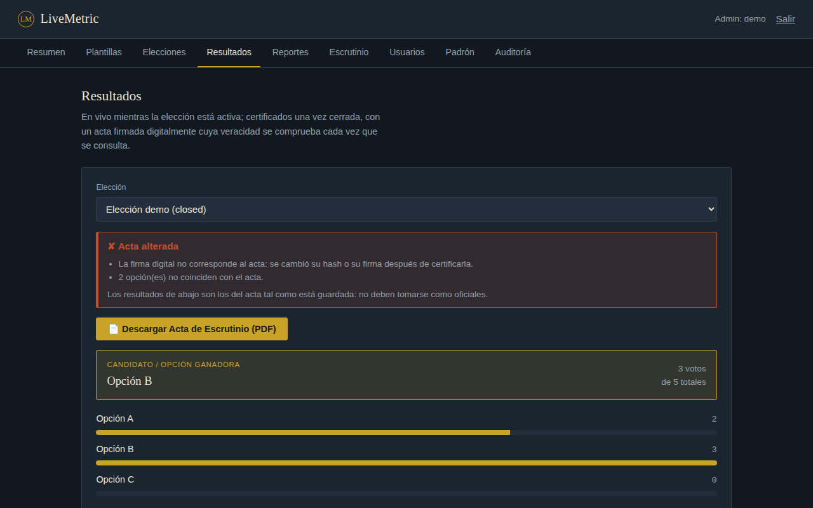

*Figura 16. El ataque de la amenaza 15, detectado: el acta dice que ganó la Opción B, pero su firma ya no corresponde y los votos guardados no coinciden con ella.*

## 6. Monitoreo y observabilidad

### 6.1 Arquitectura del monitoreo

Los servicios no tienen instrumentación propia: no exponen un endpoint `/metrics`. En lugar de dejar tableros vacíos, el monitoreo obtiene observabilidad real por fuentes que no requieren cambiar el código:

| Componente | Qué aporta |
|---|---|
| Blackbox exporter | Disponibilidad y latencia de cada servicio, sondeando sus `/health` |
| cAdvisor | CPU, memoria, red y reinicios por contenedor |
| node-exporter | Métricas del host |
| Promtail y Loki | Registros de todos los contenedores, etiquetados por servicio |
| Prometheus | Recolección de métricas y evaluación de alertas |
| Grafana | Tablero aprovisionado desde el repositorio |
| Falco | Detección de comportamiento anómalo en tiempo de ejecución |

*Tabla 11. Componentes del monitoreo.*

El monitoreo corre en un compose aparte (`monitoring/docker-compose.monitoring.yml`), para que no pueda tumbar lo que vigila: si Loki llena el disco, la votación sigue funcionando. Grafana exige una contraseña propia, generada en el `.env`, y sus puertos se publican solo en `127.0.0.1`.

### 6.2 Tablero

El tablero tiene cuatro secciones:

- **Disponibilidad.** Cuántos servicios responden, la latencia de cada uno y un indicador dedicado al worker: si se detiene, las elecciones dejan de cerrarse sin que la interfaz lo muestre.
- **Recursos.** CPU y memoria de cada contenedor.
- **Registros.**
  - Los ingresos fallidos, en tiempo real: Auth escribe cada evento de auditoría en su log como una línea JSON, sin cédulas ni contraseñas.
  - Los errores de la aplicación.
  - La actividad del proceso electoral: aperturas, cierres y certificaciones.
- **Seguridad en ejecución.** Las alertas de Falco.

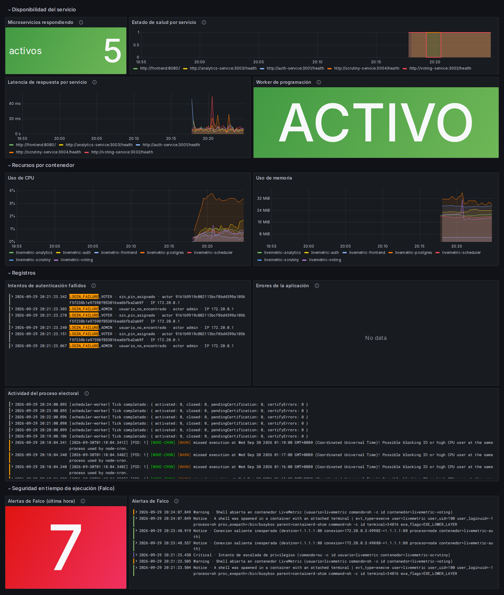

*Figura 14. Tablero de Grafana: disponibilidad, recursos, registros y alertas de Falco.*

### 6.3 Alertas

Solo se alerta sobre condiciones que exigen una acción. Una alerta que nadie atiende entrena al equipo a ignorar el tablero.

| Alerta | Severidad | Condición |
|---|---|---|
| `ServicioCaido` | Crítica | Un `/health` lleva más de un minuto sin responder |
| `SchedulerCaido` | Crítica | El worker lleva más de dos minutos inactivo |
| `LatenciaAlta` | Advertencia | Más de 2 s de respuesta durante 3 minutos |
| `ContenedorReiniciandose` | Advertencia | Un reinicio inesperado en los últimos 15 minutos |
| `MemoriaAlta` | Advertencia | Más del 90 % del límite de memoria durante 5 minutos |

*Tabla 12. Alertas de Prometheus.*

Se probaron de verdad:

- Al detener Voting, `ServicioCaido` pasó a *firing* a los 90 segundos.
- Al detener el scheduler, `SchedulerCaido` pasó a *pending* y el indicador del tablero cambió a DETENIDO.

### 6.4 Falco: detección en tiempo de ejecución

Falco es la última capa: ve lo que ocurre **dentro** de los contenedores después del despliegue, donde los escaneos estáticos no llegan. Sus reglas aprovechan el diseño del sistema. Como los contenedores corren sin root, con solo lectura y sin poder ganar privilegios, cualquier shell interactiva, escritura fuera de `/tmp` o cambio de identidad es anómalo por definición. Eso permite reglas estrictas con muy pocos falsos positivos.

| Regla | Prioridad | Qué detecta |
|---|---|---|
| Shell abierta en contenedor | WARNING | Una shell con terminal dentro de un contenedor de la aplicación o de la base |
| Escritura fuera de `/tmp` | ERROR | Una escritura en el sistema de archivos de solo lectura |
| Conexión saliente inesperada | NOTICE | Una conexión a un destino distinto de la base y los otros servicios |
| Intento de escalada de privilegios | CRITICAL | `su`, `sudo`, `chroot` o `setuid` dentro de un contenedor |

*Tabla 13. Reglas propias de Falco.*

Afinar las reglas exigió eliminar tres fuentes de falsos positivos:

- los *healthchecks* de Docker, que abren `sh -c` sin terminal;
- `runc`, que escribe al preparar cada *healthcheck*;
- el loopback de IPv6, que el scheduler usa en cada ciclo.

Además, Falco corre con `rule_matching=all`, porque por defecto sus reglas genéricas se evalúan primero y dejaban sin disparar las propias.

**Resultado de la verificación:**

- Durante varios minutos de tráfico normal (logins, API, ciclos del scheduler y sondas) Falco no emitió ninguna alerta.
- Los tres ataques simulados se detectaron en segundos: una shell en Auth, un `su` en Voting y una conexión a Internet desde Auth. Llegaron al tablero en segundos (Figura 15).
- La escritura fuera de `/tmp` no llega a generar alerta, porque el sistema de archivos de solo lectura la impide antes. La regla es la alarma para el día en que alguien quite esa protección.

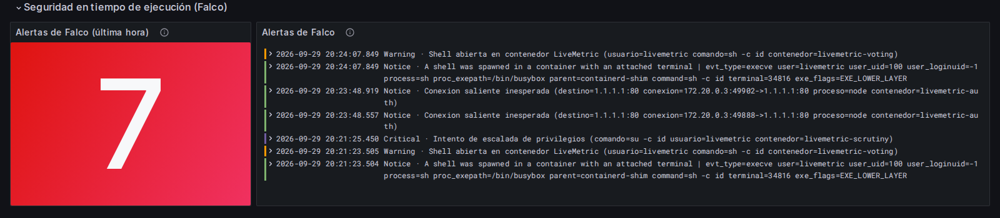

*Figura 15. Alertas de Falco en el tablero, con la regla, la prioridad y el contenedor.*

### 6.5 Limitaciones del monitoreo

- **Privilegios.** cAdvisor y Falco corren en modo privilegiado: no se puede instrumentar el kernel ni leer las métricas de todos los contenedores sin privilegios. El monitoreo tiene, por lo tanto, más privilegios que la aplicación que vigila. En un despliegue real correría en un plano separado, con su propio control de acceso.
- **Notificaciones.** Las alertas se ven en Prometheus y en el tablero, pero no se envían a ningún canal, porque falta configurar Alertmanager.
- **Métricas de negocio.** No hay métricas de negocio (votos por minuto, duración de la certificación) hasta instrumentar los servicios.

## 7. Conclusiones

### 7.1 Desafíos encontrados

- **Herramientas que no hacían lo que decían.** Ya se contó el caso de Checkov (sección 4.6). También fallaron dos actions del Marketplace: la de Gitleaks pasó a exigir una licencia de pago y la de Semgrep nunca generaba el SARIF. Las dos se reemplazaron por las imágenes oficiales de cada herramienta. La lección se repitió: un control en verde solo significa algo si alguna vez se lo vio fallar.
- **Seguridad frente a funcionamiento.** Casi todos los endurecimientos rompieron algo:
  - **nginx sin root** no podía abrir el puerto 80 ni escribir su caché. Se resolvió con el puerto 8080 y todo lo escribible en `/tmp`.
  - **La CSP estricta** bloqueaba el `<style>` que inserta html2canvas al exportar un tablero a PDF. Se autorizó ese único `<style>` por su hash, en lugar de permitir estilos en línea.
  - **En Swarm** hubo tres problemas: descarta el modo de los `tmpfs`, ignora `security_opt`, y el frontend se caía si arrancaba antes que los servicios. Se resolvieron con `tmpfs` sin opciones, `cap_drop: ALL` y resolviendo los servicios en cada petición.
- **Pasar de una base en la nube a una base por instalación.** El sistema empezó usando una base gestionada con credenciales compartidas. Pasar a un PostgreSQL local por instalación, con un `.env` generado automáticamente, eliminó los secretos compartidos, pero obligó a rehacer el arranque, las pruebas y el pipeline.
- **La integridad del acta.** La cadena de hashes parecía suficiente, hasta que el modelo de amenazas planteó a un atacante con acceso a la base que la rehace completa. De ahí salió la firma digital, y con ella la separación entre quien firma (Scrutiny) y quien verifica (Analytics).

### 7.2 Limitaciones

- **Sin HTTPS.** El sistema se sirve por HTTP en la red local; un despliegue real necesita TLS en nginx o en un balanceador.
- **ZAP no bloquea** y corre en modo pasivo (*baseline*), no con un escaneo activo completo.
- **La base es compartida entre servicios**, con un mismo usuario de PostgreSQL para todos, que además es dueño de las tablas: puede desactivar los triggers *append-only*. Tampoco tiene respaldo automático.
- **Swarm se probó en un solo nodo**, y ahí los secretos llegan a los servicios como variables de entorno.
- **Faltan procedimientos de rotación.** Cambiar la clave de cifrado del padrón requiere un script que todavía no existe, y las actas firmadas con una clave anterior pasan a verse como alteradas, porque el sistema no conserva las claves públicas viejas.
- **La cobertura de pruebas es desigual:** Auth y el scheduler están por debajo del 55 %.

### 7.3 Lecciones aprendidas

1. **El modelo de amenazas tiene que guiar el código.** Las decisiones más valiosas, como el PIN, la firma del acta, la red interna o el recuento independiente, salieron de preguntarse qué haría un atacante concreto, no de una lista de verificación.
2. **Un control hay que verlo fallar.** Checkov pasaba sin revisar nada; dos pruebas del frontend dejaban pasar defectos que decían detectar. Romper a propósito lo que se protege es la única forma de saber que el control funciona.
3. **La defensa en profundidad es concreta.** El doble voto se detiene en la API, en la transacción y en la restricción de la base. El acta se protege con un trigger, una cadena de hashes, una firma y un reconteo.
4. **La documentación también tiene deuda técnica.** Al preparar este informe se encontraron diagramas que describían versiones anteriores del sistema. La documentación se revisa igual que el código, y conviene que viva junto a él.
5. **Declarar un riesgo aceptado es mejor que esconderlo.** Por ejemplo, el repudio del voto o los privilegios del monitoreo. Escrito, con su justificación, un riesgo aceptado es una decisión; escondido, es una vulnerabilidad esperando a que la encuentren.

### 7.4 Trabajo futuro

- **Transporte y secretos.** TLS en nginx y `docker secret` en Swarm.
- **Pruebas de seguridad más profundas.** Un escaneo activo de ZAP con autenticación, y convertirlo en un control bloqueante para las alertas altas y medias.
- **Mínimo privilegio en la base.** Un usuario de PostgreSQL por servicio, con permisos solo sobre sus tablas.
- **Rotación de claves.** Un script para rotar la clave del padrón y un registro de claves públicas anteriores, para que la rotación de la clave de firma no invalide las actas viejas.
- **Monitoreo.** Métricas de negocio con `prom-client`, notificaciones con Alertmanager y retención de registros según la normativa aplicable.
- **Operación.** Respaldos automáticos y cifrados de la base.
- **Dependencias.** Actualizar Vite y mantener las dependencias al día antes de cada versión.

## Anexo. Enlaces y reproducción

| Recurso | Ubicación |
|---|---|
| Repositorio | https://github.com/NicolasPineda1421/LiveMetric |
| Imágenes | https://hub.docker.com/u/nicolaspineda1421 |
| Versión documentada | v1.3.3 (release en GitHub y tags en Docker Hub) |
| Modelo de amenazas | `docs/threat-model/livemetric.threatdragon.json` y `STRIDE-analysis.md` |
| Pipeline | `.github/workflows/devsecops.yml` y `release.yml` |
| Manuales | `docs/` (arquitectura, desarrollo, instalación y despliegue, seguridad, usuario) |
| Sustentación | `docs/sustentacion/`: la historia de usuario con su demostración y el guion del video |

Para levantar el sistema basta con Docker: `./scripts/start.sh` (Linux o macOS) o `scripts\start.bat` (Windows) generan el `.env`, corren el análisis de seguridad y, si pasa, levantan los siete contenedores en `http://localhost:3000`. Este documento se genera a partir de `docs/informe-tecnico.md` con `scripts/informe` (`npm run pdf`).
