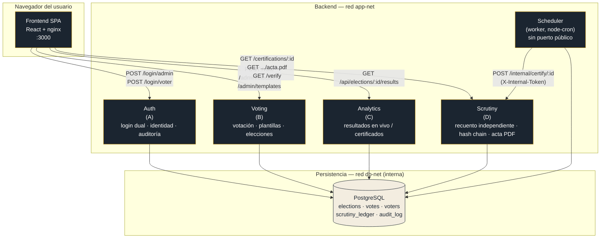
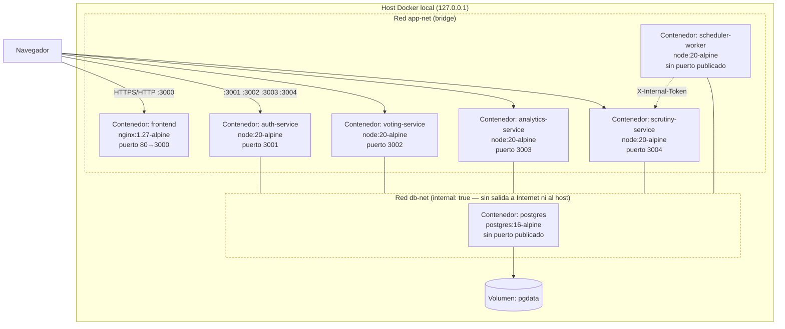
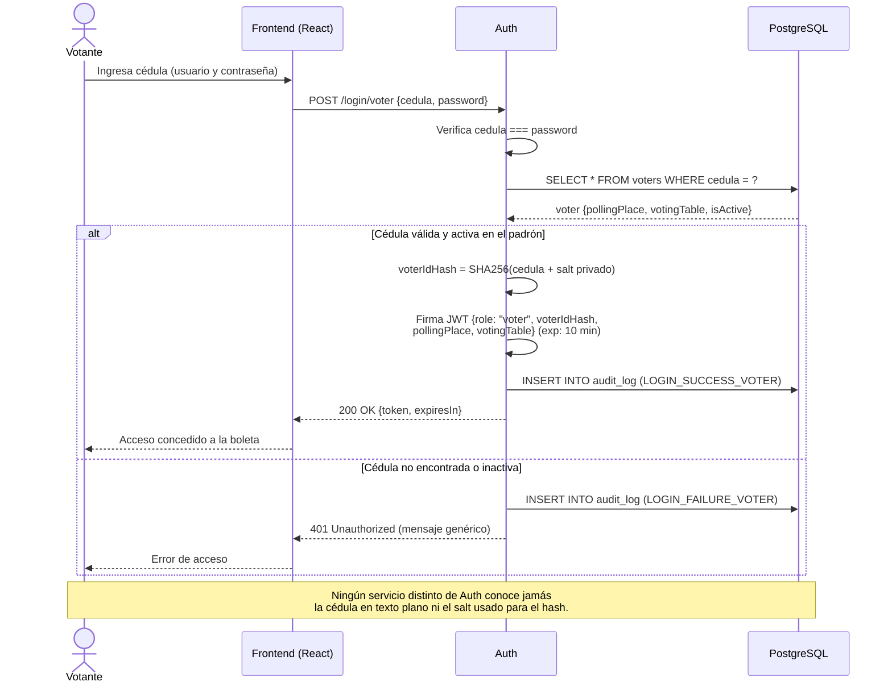
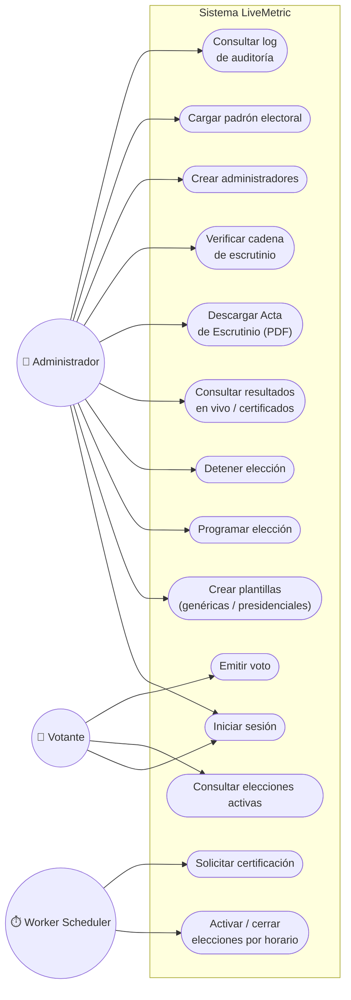
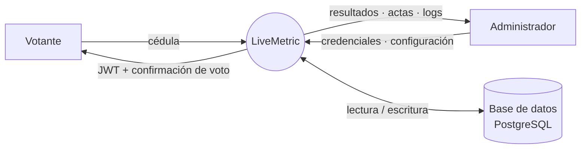
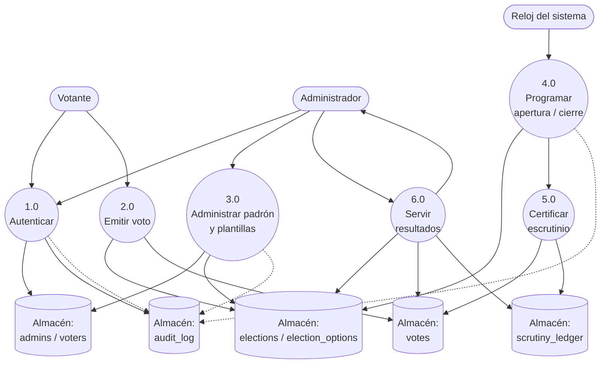
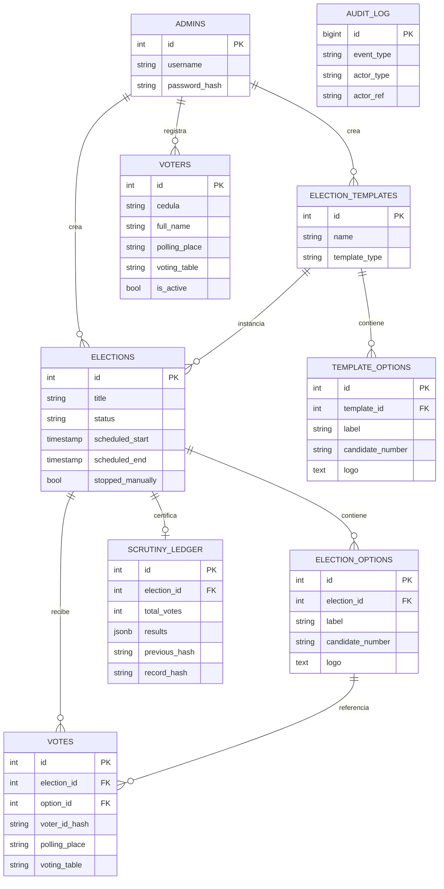

# Manual de Arquitectura — LiveMetric

> Sistema de Elecciones y Escrutinio en Tiempo Real
> Este documento corresponde a la sección 4.2 de la documentación obligatoria del curso. Todos los diagramas están escritos en **Mermaid** (código versionable dentro del repositorio) y se renderizan de forma nativa al ver este archivo en GitHub.

## Tabla de contenido

1. [Alcance y estilo arquitectónico](#1-alcance-y-estilo-arquitectónico)
2. [Patrones de diseño aplicados](#2-patrones-de-diseño-aplicados)
3. [Componentes y justificación](#3-componentes-y-justificación)
4. [Diagrama de Componentes](#4-diagrama-de-componentes)
5. [Diagrama de Despliegue](#5-diagrama-de-despliegue)
6. [Diagrama de Secuencia — Autenticación](#6-diagrama-de-secuencia--autenticación-de-votante)
7. [Diagrama de Casos de Uso](#7-diagrama-de-casos-de-uso)
8. [DFD Nivel 0](#8-dfd-nivel-0)
9. [DFD Nivel 1](#9-dfd-nivel-1)
10. [Decisiones de diseño (registro tipo ADR)](#10-decisiones-de-diseño-registro-tipo-adr)
11. [Modelo de datos (resumen)](#11-modelo-de-datos-resumen)

---

## 1. Alcance y estilo arquitectónico

LiveMetric es un **sistema de elecciones y escrutinio en tiempo real**, no un sistema genérico de encuestas: su valor central es garantizar que el resultado de una elección sea **íntegro y verificable por un tercero**, no solo "recolectar clics". Esa exigencia (más cercana a un sistema financiero o notarial que a un formulario) es la que determina casi todas las decisiones de arquitectura descritas en este documento.

El sistema se implementa como una **arquitectura de microservicios** con seis unidades desplegables independientes — un frontend SPA, cuatro microservicios HTTP y un worker asíncrono — sobre el principio **Local-First**: todo el stack corre en contenedores Docker en una máquina local, sin depender de ningún servicio en la nube, usando exclusivamente herramientas de código abierto.

Estilo arquitectónico resumido:

| Atributo | Decisión | Motivo |
|---|---|---|
| Descomposición | Por **dominio de negocio** (identidad, votación, analítica, escrutinio), no por capa técnica | Cada servicio tiene un único motivo para cambiar (Single Responsibility a nivel de servicio) |
| Comunicación | HTTP síncrono (REST) entre frontend↔backend y entre `scheduler-worker`↔`scrutiny-service` | Simplicidad operativa; el volumen de este dominio (elecciones, no big data) no justifica un broker de mensajería |
| Persistencia | **Base de datos compartida** (PostgreSQL) entre los cuatro microservicios | Simplificación consciente para el alcance del proyecto (ver ADR-005); se documenta como trade-off, no como descuido |
| Confianza entre servicios | **Zero-trust interno**: cada llamada entre servicios se autentica (JWT de rol o token de servicio), incluso dentro de la red privada | Un atacante que comprometa un contenedor no hereda automáticamente privilegios sobre los demás |
| Estado de la UI | Sesión (JWT) **solo en memoria** del navegador, nunca en `localStorage` | Un puesto de votación es un equipo compartido; recargar la página cierra la sesión por diseño |

---

## 2. Patrones de diseño aplicados

| Patrón | Dónde se usa | Por qué |
|---|---|---|
| **Append-only ledger** (libro contable inmutable) | `scrutiny_ledger`, `audit_log` (trigger de PostgreSQL que rechaza `UPDATE`/`DELETE`) | Un acta certificada o un evento de auditoría no debe poder reescribirse ni siquiera con acceso directo a la base de datos |
| **Hash chain** (cadena de hashes, patrón simplificado de blockchain) | Certificación en `scrutiny-service`: `record_hash = SHA256(previous_hash + resultados)` | Permite detectar si un acta antigua fue alterada: la alteración rompe visiblemente la cadena hacia adelante |
| **Snapshot / copia en el momento de creación** | `election_options` copia `label`/`candidate_number`/`logo` desde `template_options` al instanciar la elección | Si la plantilla se edita después, las elecciones ya creadas no cambian retroactivamente |
| **Defensa en profundidad** | Anti-doble-voto: validación de tipos + transacción + `UNIQUE(election_id, voter_id_hash)` en BD | Ninguna capa individual es el único punto de falla |
| **Identidad pseudonimizada** | `voter_id_hash = SHA256(cedula + salt privado de Auth)` | Ningún otro servicio ve la cédula en texto plano; el salt nunca sale de Auth |
| **Token de servicio interno** (distinto de JWT de usuario) | `X-Internal-Token` entre `scheduler-worker` y `scrutiny-service`, comparado con `timingSafeEqual` | Ni un admin ni un votante deben poder disparar una certificación manualmente; solo el propio sistema |
| **Poller asíncrono** (worker con `node-cron`) en vez de cola de mensajes | `scheduler-worker` | Para el volumen de este dominio, un tick por minuto que revisa "¿qué elección debe abrir/cerrar?" es más simple de operar y depurar que un broker (RabbitMQ/Kafka) sin aportar beneficio real a esta escala |
| **Rol explícito por token** (RBAC vía claim `role`) | Middlewares `requireAdmin` / `requireVoter` en cada servicio | Un JWT de votante nunca es válido en una ruta `/admin/*`, y viceversa, verificado en cada servicio de forma independiente (no solo en un gateway central) |

---

## 3. Componentes y justificación

### 3.1 Frontend (React + Vite + nginx)

**Responsabilidad:** interfaz para administradores (gestión de plantillas, elecciones, padrón, usuarios, auditoría) y para votantes (login por cédula, boleta, confirmación de voto).

**Por qué así:** una SPA evita recargas de página completas durante el flujo de votación (importante en un puesto físico con muchos votantes en fila). Se sirve con nginx en producción (no con el servidor de desarrollo de Vite) porque nginx es el estándar de facto para servir estáticos de forma eficiente y porque permite inyectar configuración en tiempo de arranque del contenedor (ver `docker-entrypoint.sh`) sin reconstruir la imagen.

**Decisión de seguridad notable:** el proceso maestro de nginx corre como `root` (no se fuerza un usuario no-root), a diferencia del resto de contenedores del proyecto. Esto se documenta explícitamente en el ADR-006: es el modelo estándar de nginx (el maestro necesita abrir el puerto 80 y preparar su caché; los *workers* que procesan tráfico externo corren sin privilegios por configuración propia de la imagen oficial), y forzarlo rompía funcionalidad sin aportar seguridad real.

### 3.2 Microservicio A — Auth

**Responsabilidad:** dos flujos de login completamente distintos (administrador con usuario/contraseña; votante con cédula), gestión de identidad (crear admins, cargar el padrón electoral) y el módulo de auditoría.

**Por qué es un servicio separado:** la autenticación es el único lugar del sistema que debe conocer el salt privado usado para pseudonimizar la cédula (`VOTER_ID_SALT`). Aislarlo minimiza la superficie de código que maneja ese secreto.

### 3.3 Microservicio B — Voting

**Responsabilidad:** votación pública (`POST /vote`) y administración del ciclo de vida de la elección: plantillas (genéricas o presidenciales), instanciación de elecciones con ventana de tiempo, y detención manual.

**Por qué votación y administración conviven en el mismo servicio:** ambas operan sobre el mismo agregado de datos (`elections`, `election_options`, `votes`) y comparten las mismas invariantes de integridad (ej. "no se puede votar en una elección que no está `active`"); separarlas en dos servicios distintos obligaría a sincronizar esa regla de negocio en dos lugares.

### 3.4 Microservicio C — Analytics

**Responsabilidad:** exclusivamente **lectura** de resultados — en vivo si la elección sigue activa, o el acta ya certificada si cerró.

**Por qué es un servicio separado de Voting:** separa el camino de escritura (votar) del camino de lectura (consultar resultados), que tienen perfiles de carga y de seguridad distintos — Analytics nunca necesita aceptar un voto, así que no expone esa superficie de ataque.

### 3.5 Microservicio D — Scrutiny

**Responsabilidad:** recuento **independiente** desde los votos crudos (nunca reutiliza el cálculo de Analytics), consolidación por mesa de votación, determinación del ganador, certificación con cadena de hashes, y generación del Acta de Escrutinio en PDF.

**Por qué es un servicio separado de Analytics (la decisión más importante del proyecto):** si Scrutiny reutilizara el mismo código de conteo que Analytics, un error o una manipulación en esa única pieza de lógica falsearía tanto lo que se muestra en pantalla como lo que queda certificado, sin ninguna capa independiente que lo detecte. Al vivir en un servicio propio, con su propia consulta SQL sobre `votes`, Scrutiny actúa como un "segundo escrutador" real, tal como en una elección física donde el conteo de mesa y la verificación posterior las hace gente distinta.

### 3.6 Worker — Scheduler

**Responsabilidad:** proceso asíncrono (`node-cron`, sin servidor HTTP de negocio) que activa elecciones al llegar `scheduled_start`, las cierra al llegar `scheduled_end` (o detecta un cierre manual), y dispara la certificación en Scrutiny.

**Por qué existe como proceso separado y no como un `setInterval` dentro de Voting:** si el temporizador viviera dentro de Voting, un reinicio o una caída de ese servicio detendría silenciosamente el cierre automático de elecciones. Como proceso independiente, su único trabajo es "vigilar el reloj", y su caída no afecta la capacidad de votar o consultar resultados — solo retrasa la activación/cierre hasta que se recupere.

### 3.7 Base de datos — PostgreSQL

**Responsabilidad:** persistencia relacional de todo el dominio, incluyendo las dos tablas append-only (`scrutiny_ledger`, `audit_log`).

**Por qué PostgreSQL y no un motor NoSQL:** el dominio electoral es intrínsecamente relacional (una elección tiene opciones, un voto referencia una opción y una elección, un votante pertenece a un puesto y una mesa) y depende de **transacciones ACID** para las invariantes críticas (el `UNIQUE(election_id, voter_id_hash)` que impide el doble voto solo es confiable dentro de una transacción).

---

## 4. Diagrama de Componentes

**Lectura del diagrama:** el frontend nunca habla directamente con la base de datos ni con el worker; solo consume las APIs HTTP de los cuatro microservicios. El worker es el único componente que le habla a Scrutiny con un mecanismo de autenticación distinto (token de servicio) al resto del sistema (JWT de usuario).

---

## 5. Diagrama de Despliegue

**Notas de despliegue:**
- `db-net` está marcada `internal: true`: PostgreSQL no tiene ruta de salida a Internet ni es alcanzable desde el host — solo los contenedores conectados a esa red pueden hablarle.
- Ningún puerto se publica en `0.0.0.0`; todos los `ports:` del `docker-compose.yml` usan explícitamente `127.0.0.1:<puerto>:<puerto>`.
- El volumen `pgdata` es el único estado persistente fuera de la imagen; borrar el volumen (`docker compose down -v`) reinicia el sistema al seed de arranque.
- Terraform (`infra/terraform/main.tf`) reproduce exactamente esta misma topología usando el proveedor `kreuzwerker/docker`, como alternativa a Docker Compose.

---

## 6. Diagrama de Secuencia — Autenticación de votante

Se eligió el login de votante como "flujo crítico" (en vez del de administrador) porque es el que introduce las decisiones de seguridad más particulares de este dominio: la cédula funciona como usuario y contraseña a la vez, y de ahí en adelante todo el sistema debe operar sobre una identidad pseudonimizada.

---

## 7. Diagrama de Casos de Uso

> Mermaid no tiene un tipo de diagrama nativo "Use Case" con la notación UML clásica (actor + óvalos); se representa aquí con la notación de flujo equivalente, agrupando los casos de uso por actor dentro del límite del sistema.

---

## 8. DFD Nivel 0

---

## 9. DFD Nivel 1

**Nota metodológica:** este DFD se documentó manualmente siguiendo la notación estándar (procesos numerados, almacenes como bordes abiertos/cilindros, entidades externas como rectángulos). Para la entrega final del curso se recomienda además exportar el modelo equivalente como `threat-model.json` usando **OWASP Threat Dragon**, de forma que quede versionado junto a este archivo.

---

## 10. Decisiones de diseño (registro tipo ADR)

| # | Decisión | Alternativa considerada | Por qué se eligió esta opción |
|---|---|---|---|
| ADR-001 | Scrutiny es un microservicio separado de Analytics | Calcular el "acta" dentro de Analytics reutilizando su misma consulta | Un recuento "oficial" no puede depender del mismo código que el recuento "informativo"; deben ser dos implementaciones independientes para que una sirva de control de la otra |
| ADR-002 | Anti-doble-voto anclado a `voter_id_hash` (identidad real) | Fingerprint de IP + User-Agent (usado en una iteración temprana del proyecto) | El fingerprint es trivial de burlar (otra red, modo incógnito); la identidad real, aunque pseudonimizada, es estable por persona |
| ADR-003 | JWT de votante con expiración de 10 minutos | Misma expiración que el JWT de administrador (1 hora) | El login de votante no protege un secreto real (cédula = usuario y contraseña); acortar la ventana de validez es el control compensatorio principal frente a ese riesgo aceptado |
| ADR-004 | `scheduler-worker` como proceso independiente con `node-cron` | `setInterval` dentro de `voting-service`, o un cron del sistema operativo host | Aísla el fallo: si el worker cae, votar y consultar resultados siguen funcionando; solo se retrasa la apertura/cierre automático |
| ADR-005 | Base de datos compartida entre los cuatro microservicios | Una base de datos por servicio (patrón "database per service" puro) | Simplificación consciente para el alcance del proyecto: las invariantes transaccionales críticas (`UNIQUE` anti-doble-voto) exigen que "votes" y "elections" convivan en la misma base transaccional; se documenta como deuda técnica aceptada, no como omisión |
| ADR-006 | El proceso maestro de nginx (frontend) corre como `root` | Forzar `USER` no-root en toda la imagen (como en los demás servicios) | Se intentó primero forzar no-root y rompió dos veces (permisos de escritura, apertura de puerto 80); se revirtió al modelo estándar de nginx, donde los *workers* que procesan tráfico externo sí corren sin privilegios |
| ADR-007 | Terminología del dominio: "elección", nunca "encuesta" | Mantener "poll/encuesta" como en la primera iteración del proyecto | El valor del sistema es la integridad electoral, no la recolección de opiniones; el lenguaje del código y la UI debe reflejar ese dominio para evitar decisiones de diseño "de encuesta" (ej. permitir cambiar el voto) que serían incorrectas en un contexto electoral |
| ADR-008 | El Acta de Escrutinio se genera como PDF real (`pdfkit`) | Mostrar solo un JSON/tabla en el panel de administración | El escrutinio de una elección real termina en un documento firmable; un JSON en pantalla no cumple esa función simbólica ni práctica (no se puede archivar, imprimir ni entregar) |

---

## 11. Modelo de datos (resumen)

*(`AUDIT_LOG` no tiene llave foránea hacia otras tablas — es intencional: el log de auditoría no debe depender referencialmente de los registros que audita, para que siga existiendo aunque el recurso auditado cambie o se elimine.)*
