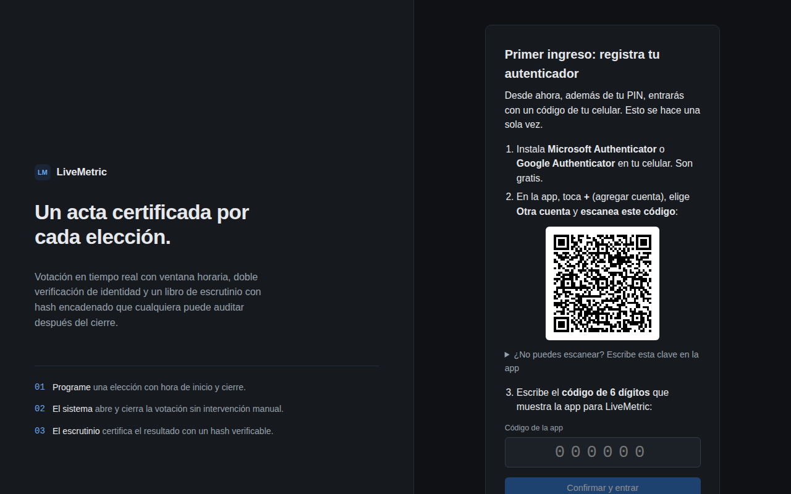
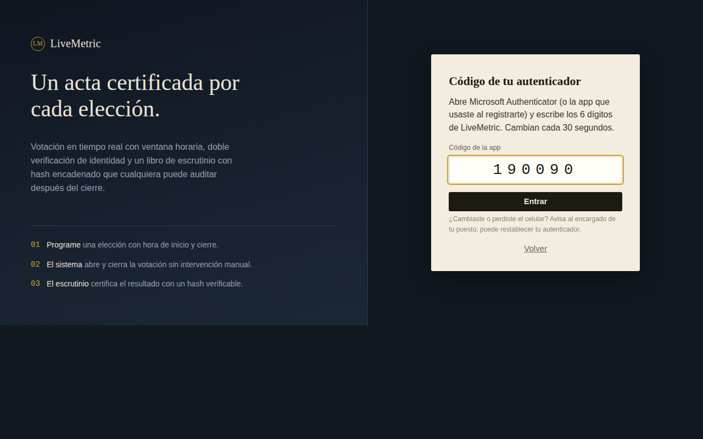
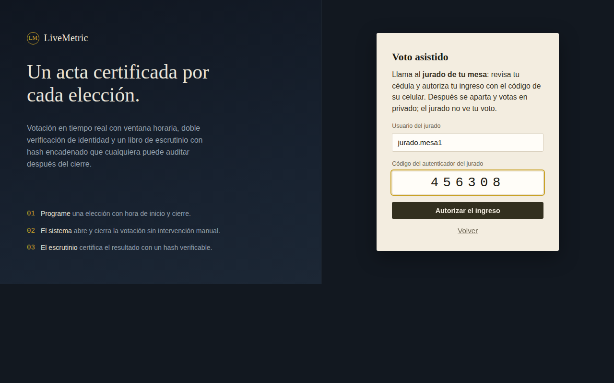
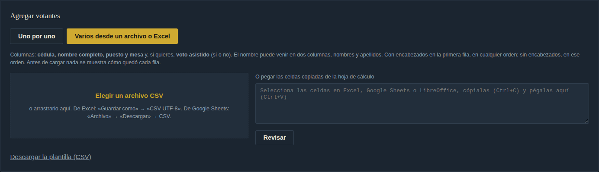
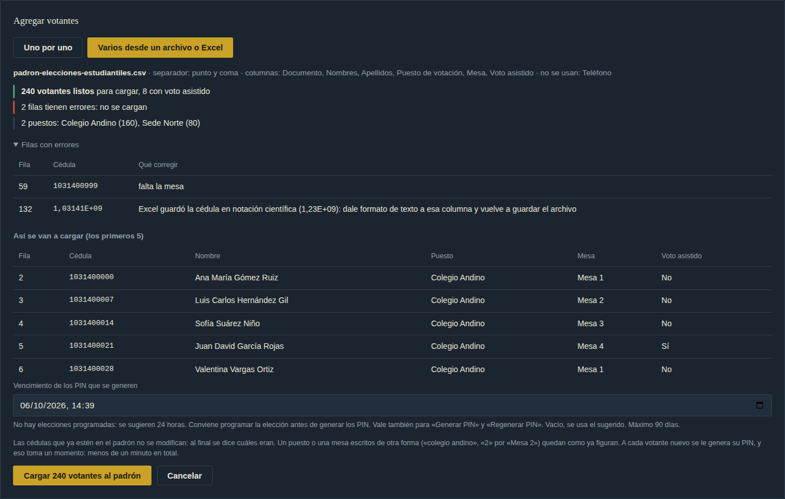
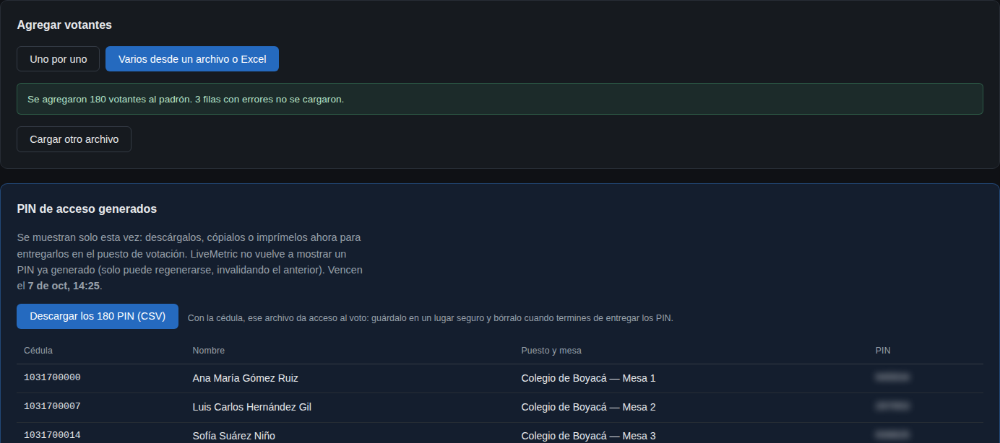
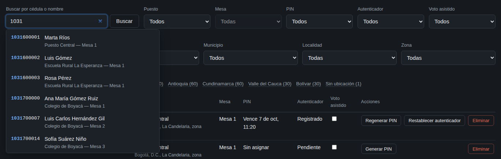
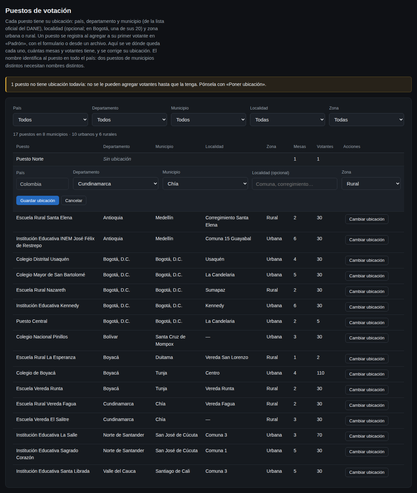
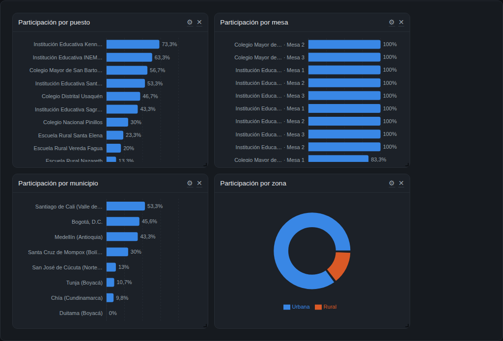
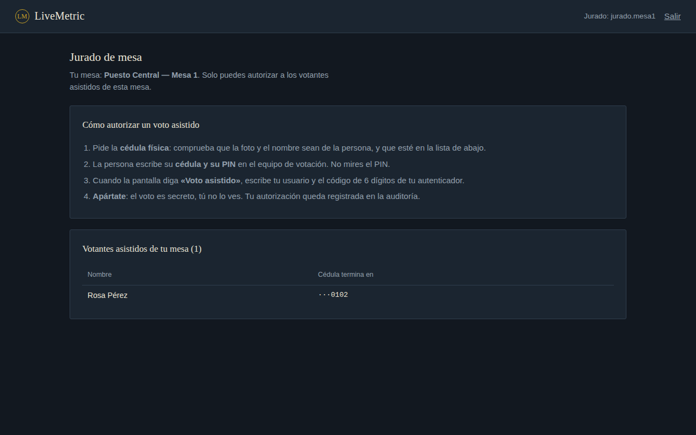

# Manual de Usuario — LiveMetric

> Sistema de Elecciones y Escrutinio en Tiempo Real
> Documento correspondiente a la sección 4.6 de la documentación obligatoria del curso.

Este manual está escrito para quien **usa** LiveMetric, no para quien lo instala ni lo
desarrolla. Si necesita levantar el sistema, vea
[Instalación y despliegue](instalacion-y-despliegue.md).

---

## Tabla de contenido

1. [Antes de empezar](#1-antes-de-empezar)
2. [Los cuatro tipos de usuario](#2-los-cuatro-tipos-de-usuario)
3. [Ingreso al sistema](#3-ingreso-al-sistema)
4. [Guía del Administrador](#4-guía-del-administrador)
5. [Guía del Votante](#5-guía-del-votante)
6. [Guía del Auditor](#6-guía-del-auditor)
7. [Guía del Jurado de mesa](#7-guía-del-jurado-de-mesa)
8. [Ciclo completo de una elección](#8-ciclo-completo-de-una-elección)
9. [Preguntas frecuentes](#9-preguntas-frecuentes)

---

## 1. Antes de empezar

LiveMetric se usa desde el navegador. Una vez que el sistema está levantado, se accede en:

```
http://localhost:3000
```

Desde otro equipo de la misma red, se reemplaza `localhost` por la IP del servidor.

No requiere instalar nada en el equipo del usuario. Funciona en Chrome, Firefox y Edge
en sus versiones recientes.


*Captura 01. La pantalla de ingreso: primero el ingreso de votantes y, debajo, aparte, el botón para el administrador, el auditor o el jurado.*

---

## 2. Los cuatro tipos de usuario

| Rol | Cómo entra | Qué puede hacer |
|---|---|---|
| **Administrador** | usuario + contraseña | Todo: crear plantillas y elecciones, cargar el padrón, generar PINes, crear usuarios, consultar resultados, escrutinio y auditoría |
| **Auditor** | usuario + contraseña | **Solo lectura**: consultar resultados y reportes. No puede modificar nada |
| **Jurado de mesa** | usuario + contraseña + código de su autenticador | Autorizar el ingreso de los votantes asistidos de **su** mesa. No ve votos ni puede gestionar nada |
| **Votante** | cédula + PIN de acceso + código de su autenticador (o, si vota asistido, la autorización del jurado) | Ver las elecciones abiertas, emitir su voto y consultar su historial |

El rol de **Auditor** existe para que alguien pueda supervisar el proceso sin tener
capacidad de alterarlo. Es la aplicación del principio de mínimo privilegio: quien
verifica no necesita poder modificar.

---

## 3. Ingreso al sistema

La pantalla de inicio muestra primero el **Ingreso de votantes**, que son quienes más
entran. El administrador, el auditor y el jurado entran con el botón que está debajo,
aparte: **Ingresar como administrador, auditor o jurado**.

### 3.1 Administrador, Auditor o Jurado

1. Debajo del ingreso de votantes, botón **Ingresar como administrador, auditor o
   jurado**. (Para volver, **← Volver al ingreso de votantes**.)
2. Escriba su **Usuario** y **Contraseña**.
3. Botón **Ingresar como administrador**.

El sistema lo lleva al panel que corresponde a su rol: los administradores ven diez
pestañas; los auditores, solo dos. El **jurado** tiene un paso más: el código de su
autenticador, igual que el votante (ver [3.2](#32-votante)); la primera vez, lo registra.


*Captura 02. Ingreso de administrador: el usuario escrito y la contraseña oculta.*

### 3.2 Votante

1. Es lo primero que aparece en la pantalla de inicio: **Ingreso de votantes**.
2. Escriba su número de **Cédula**.
3. Escriba su **PIN de acceso**, que le entrega el encargado de su puesto de votación.
4. Botón **Ingresar a votar**.
5. El segundo paso depende de su caso: la primera vez registra su autenticador; después,
   escribe su código; si vota asistido, lo autoriza el jurado de su mesa. Se explica abajo.


*Captura 03. Ingreso de votante: la cédula, el PIN oculto mientras se escribe y el texto de ayuda.*

**¿Por qué un segundo paso?** El PIN lo entrega una persona y se puede perder, filtrar o
ver por encima del hombro. Con el código de su celular, quien tenga solo el PIN no puede
votar en su nombre.

#### Primer ingreso: registrar el autenticador

Se hace **una sola vez**, con la ayuda del encargado del puesto si hace falta:

1. Instale **Microsoft Authenticator** o **Google Authenticator** en su celular (son
   gratis, en la tienda de aplicaciones).
2. En la app, toque **+** (agregar cuenta), elija **Otra cuenta** y **escanee el código
   QR** que muestra la pantalla. Si no puede escanearlo, toque *«¿No puedes escanear?»* y
   escriba la clave en la app.
3. La app muestra un código de 6 dígitos para **LiveMetric**. Escríbalo y toque
   **Confirmar y entrar**.


*Captura 28. Primer ingreso del votante: los tres pasos para registrar su autenticador, con el QR.*

> 💡 **Huella o rostro:** en Microsoft Authenticator puede activar *Configuración → Bloqueo
> de aplicación*, para que la app pida su huella o su rostro antes de mostrar los códigos.
> Así, aunque alguien tome su celular desbloqueado, no ve el código.

Si al confirmar aparece *«Esta cédula ya tiene un autenticador registrado»* y usted no lo
registró, avise al encargado del puesto: alguien usó su PIN antes que usted. El
administrador puede restablecer el autenticador.

#### Ingresos siguientes: el código

Después de la cédula y el PIN, abra la app y escriba los **6 dígitos de LiveMetric**.
Cambian cada 30 segundos; si el código cambia mientras lo escribe, el anterior sirve
unos segundos más. Cada código sirve **una sola vez**.


*Captura 29. Ingresos siguientes: el código de 6 dígitos de la app.*

#### Voto asistido

Si usted no tiene un celular con apps o no puede usarlo, el administrador lo marca para el
**voto asistido**. Después de su cédula y su PIN, la pantalla dice **«Voto asistido»**:

1. Llame al **jurado de su mesa**. Él revisa su cédula física.
2. El jurado escribe **su** usuario y **el código de su propio autenticador**.
3. El jurado se aparta y usted vota en privado: **el jurado no ve su voto**.


*Captura 30. Voto asistido: el jurado de la mesa escribe su usuario y el código de su autenticador.*

Solo puede autorizarlo el jurado **de su mesa** (o uno asignado a todo su puesto), y cada
autorización queda registrada con el nombre del jurado.

**Si el ingreso falla**, el sistema siempre responde lo mismo: *"Cédula o PIN
incorrectos"*. No distingue entre una cédula que no existe y un PIN equivocado. Esto es
intencional: evita que alguien pueda averiguar quién está inscrito en el padrón probando
números de cédula.


*Captura 04. Un intento fallido: el mensaje es el mismo si la cédula no existe o si el PIN es incorrecto.*

**El PIN tiene fecha de vencimiento:** vale 24 horas desde que el administrador lo genera.
Hasta entonces se puede ingresar haya o no una votación abierta: por ejemplo, para
registrar el autenticador antes de votar. Votar, en cambio, solo se puede dentro del horario de la elección. Si el PIN ya
venció, el sistema lo dice (*"Tu PIN venció"*) y hay que pedir uno nuevo al encargado del
puesto. Ese aviso aparece solo con el PIN correcto, así que no le da pistas a quien prueba
PIN al azar.

**La sesión del votante dura 10 minutos.** Es tiempo suficiente para votar, y limita el
riesgo si alguien deja la sesión abierta en un equipo compartido. Además, recargar la
página cierra la sesión: en un puesto de votación el equipo pasa de mano en mano, y
dejar la sesión guardada en el navegador sería un riesgo.

---

## 4. Guía del Administrador

El panel de administración tiene diez pestañas.


*Captura 05. El panel del administrador, con sus diez pestañas y Resumen activa.*

### 4.1 Resumen

Muestra el estado general del sistema: cuántas elecciones hay **Programadas**, **Activas**
y **Cerradas**, más una guía de primeros pasos.

Es la pantalla de control: de un vistazo se sabe si hay una votación en curso.


*Captura 06. Resumen: una elección programada, una activa y una cerrada.*

### 4.2 Plantillas

Una **plantilla** es el modelo reutilizable de una votación: define qué se pregunta y
cuáles son las opciones. Se crea una vez y sirve para muchas elecciones.

Para crear una:

1. Pestaña **Plantillas** → **Nueva plantilla**.
2. Escriba el **Nombre** (por ejemplo, *Elección Presidencial 2026*).
3. Opcionalmente, una **Descripción**.
4. En **Candidatos**, agregue cada opción con su **número**, **nombre** y, si desea, un
   **logo o foto**.
5. Use **Quitar** para eliminar una fila que sobre.
6. Guarde la plantilla.


*Captura 07. Nueva plantilla presidencial con cuatro candidatos: número, nombre y foto.*


*Captura 08. Las plantillas existentes, con sus candidatos u opciones.*

### 4.3 Elecciones

Aquí se **instancia** una plantilla: se convierte el modelo en una votación real con
fecha y hora.

1. Pestaña **Elecciones** → **Nueva elección**.
2. Elija la **Plantilla** en el desplegable.
3. Escriba el **Título de la elección**.
4. Defina **Apertura** y **Cierre** (fecha y hora).
5. Botón **Programar elección**.

La elección queda en estado **Programada**. **No hay que abrirla ni cerrarla a mano**: el
sistema la abre sola al llegar la hora de apertura y la cierra sola al vencer la de
cierre. Un componente interno revisa esto de forma continua.

Si necesita terminar una votación antes de tiempo, use **Detener** sobre una elección
activa.


*Captura 09. Nueva elección: plantilla, título y ventana de apertura y cierre.*


*Captura 10. Las elecciones en sus tres estados: programada, activa y cerrada.*

### 4.4 Padrón

El **padrón** es la lista de quiénes tienen derecho a votar. Sin estar en el padrón, una
persona no puede ingresar.

**Agregar votantes.** Hay dos formas: **Uno por uno**, con el formulario, y **Varios desde
un archivo o Excel**, para cargar cientos o miles de una vez (ver más abajo). Con el
formulario:

1. Pestaña **Padrón**, sección **Agregar votantes**, **Uno por uno**.
2. Complete los datos del votante: **Cédula**, **Nombre completo**, **Puesto de votación**
   y **Mesa**. El puesto y la mesa sugieren los que ya están en el padrón.
3. Debajo aparece la **ubicación del puesto**. Si el puesto ya está registrado, solo se
   muestra ("Ubicación del puesto: Chía (Cundinamarca), zona rural"). Si es nuevo (o
   todavía no tiene ubicación), el formulario la pide: **Departamento** y **Municipio** de
   las listas oficiales del DANE, **Localidad** (opcional; en Bogotá, una de sus 20
   localidades) y **Zona** (*Urbana* o *Rural*). El país es Colombia.
4. Para agregar varios de una vez, **+ Agregar otro votante**: la fila nueva copia el
   puesto, la mesa y la ubicación de la anterior. Si varios votantes son del mismo puesto
   nuevo, la ubicación se pide solo en el primero ("la del votante 1"). **Quitar** saca
   una fila del formulario.
5. Botón **Agregar al padrón** (o **Agregar N votantes al padrón**).

Si una cédula ya está en el padrón, no se modifica: el sistema avisa *"Ya estaban y no se
modificaron"* y agrega el resto. Si el puesto o la mesa ya figuran escritos de otra forma
("puesto central", "1"), se guardan como figuran ("Puesto Central", "Mesa 1").

**Cada puesto tiene su ubicación.** Todo puesto de votación necesita su país, su
departamento, su municipio, su zona (urbana o rural) y, si se quiere, su localidad (o
comuna, o corregimiento). Se registra con el primer votante del puesto y después se ve y
se corrige en la pestaña **Puestos** (sección 4.5). Un puesto que ya tiene ubicación no
la cambia al agregar votantes: si alguien escribe otra, el sistema lo rechaza, porque
podría ser otro puesto con el mismo nombre. **El nombre identifica al puesto en todo el
país**, así que dos puestos de municipios distintos necesitan nombres distintos (por
ejemplo, "Colegio Central - Tunja" y "Colegio Central - Duitama").

**Los datos de un votante no se editan.** Si algo está mal, se elimina y se vuelve a
agregar (ver más abajo).

**Generar los PINes:**

Cada votante nuevo recibe un **PIN de acceso** al agregarlo, que aparece en la sección
**PIN de acceso generados**, con su nombre, su puesto y su mesa. **Descargar los PIN
(CSV)** los baja en un archivo para imprimirlos o repartirlos por mesa (ver la advertencia
de la carga desde un archivo, más abajo).

**Vencimiento de los PIN.** Cada PIN vence **24 horas después de generarlo**, al agregar
al votante o al regenerar su PIN: el tiempo empieza a correr en ese momento, sin importar
cuándo sea la elección. No hay fecha para elegir; el panel dice cuánto vale cada PIN. Por
eso conviene **generar y entregar los PIN poco antes de la elección**. Si alguno vence
antes de que la persona vote, se le regenera desde el listado. (Quien administra la
instalación puede cambiar esas 24 horas con `PIN_VIGENCIA_HORAS` en el `.env`, de 1 hora a
90 días.)

Hasta que vence, el PIN sirve haya o no una votación abierta; votar solo se puede dentro
del horario de la elección.

> ⚠️ **Importante:** el PIN se muestra **una sola vez**, en el momento de generarlo.
> Después el sistema solo guarda una versión cifrada que no se puede revertir. Guarde o
> imprima los PINes en ese momento; si se pierde uno, hay que generarlo de nuevo para esa
> persona.

Si un votante pierde su PIN, o se le venció, el administrador se lo regenera desde el
listado del padrón. La columna **PIN** dice hasta cuándo vale cada uno, si ya está
*Vencido*. (Los generados antes de que existiera el vencimiento recibieron uno al
actualizar.)

**Autenticador y voto asistido.** El listado muestra, para cada votante:

- **Autenticador**: *Registrado* (ya lo configuró), *Pendiente* (lo registra en su primer
  ingreso) o *No lo usa* (vota asistido).
- **Voto asistido**: la casilla marca a quien no puede usar una app. Entrará con su PIN y
  la autorización del jurado de su mesa. El sistema pide confirmación y lo registra en la
  auditoría.
- **Restablecer autenticador**: para quien cambió o perdió el celular. En su próximo
  ingreso, con su cédula y su PIN, lo registra de nuevo.


*Captura 11. Agregar votantes con el formulario: una fila por votante (cédula, nombre, puesto y mesa) y, debajo de cada uno, la ubicación de su puesto. El primero es de un puesto ya registrado; el segundo, de uno nuevo, que pide departamento, municipio, localidad y zona; el tercero, del mismo puesto nuevo, toma la ubicación del segundo. Al final, cuánto vale cada PIN: 24 horas desde que se genera.*


*Captura 12. Los PIN generados, que se muestran una sola vez, con su fecha de vencimiento y el botón para descargarlos. Marta Ríos quedó en "Puesto Central — Mesa 1". En esta captura los PIN están difuminados: no deben quedar credenciales en la documentación.*

**Cargar muchos votantes a la vez (archivo o Excel).** Para un padrón de cientos o miles
de personas, **Varios desde un archivo o Excel** los carga desde una hoja de cálculo:

1. Prepare la hoja con una fila por votante y las columnas **Cédula**, **Nombre
   completo** (o dos columnas, **Nombres** y **Apellidos**), **Puesto de votación**,
   **Mesa** y, si quiere, **Voto asistido** (*sí* o *no*). Para los puestos que todavía no
   tienen ubicación, agregue además **Departamento**, **Municipio** (o **Ciudad**),
   **Zona** (*urbana* o *rural*) y, si quiere, **Localidad** y **País** (*Colombia*). La
   ubicación basta en **una** de las filas de cada puesto, y un puesto que ya la tiene no
   la necesita. El departamento y el municipio se reconocen sin tildes, en mayúsculas, con
   el nombre de uso común ("Cúcuta", "Cali") o con su código del DANE ("15001"). Con
   encabezados en la primera fila, las columnas pueden ir en cualquier orden y llamarse de
   otras formas habituales ("Documento", "N° de documento", "Puesto", "Ciudad"); las demás
   (correo, teléfono) se ignoran. Sin encabezados, van en el orden de la plantilla: 4
   columnas (cédula, nombre, puesto y mesa), 5 (y voto asistido) o 10 (y país,
   departamento, municipio, localidad y zona). **Descargar la plantilla (CSV)** baja un
   ejemplo listo para llenar.
2. Elija una de dos formas:
   - **Un archivo CSV.** En Excel, *Guardar como* → *CSV UTF-8* (también sirve el *CSV
     (delimitado por comas)* del Excel en español, que separa con punto y coma); en Google
     Sheets, *Archivo* → *Descargar* → *CSV*; en LibreOffice, *Guardar como* → *CSV*.
     Después, **Elegir un archivo CSV**, o arrástrelo al recuadro. Un libro `.xlsx` no se
     acepta directamente: hay que guardarlo como CSV.
   - **Copiar y pegar.** Seleccione las celdas en la hoja de cálculo (con o sin la fila de
     encabezados), cópielas (**Ctrl+C**), péguelas en el recuadro (**Ctrl+V**) y pulse
     **Revisar**.
3. Antes de cargar nada, el sistema muestra la **revisión** (captura 34): cuántos votantes
   están listos, cuántos votan asistidos, los **puestos con su ubicación** (cuáles ya
   estaban registrados y cuáles se registran con la ubicación del archivo), las **filas
   con errores** (con su número de fila y qué corregir) y las **cédulas repetidas** en el
   archivo (se carga solo la primera vez que aparece), y los primeros cinco como van a
   quedar. Las cédulas con puntos de miles ("1.000.000.001") se limpian solas. Una cédula
   que Excel convirtió en notación científica ("1,03141E+09") aparece como error: hay que
   darle formato de *Texto* a esa columna y volver a guardar. También son errores un
   puesto nuevo sin ubicación en ninguna de sus filas, un municipio que no está en ese
   departamento, una localidad de Bogotá que no es una de las 20, o una ubicación distinta
   de la que el puesto ya tiene.
4. Pulse **Cargar N votantes al padrón**. Cada PIN vence 24 horas después de generarse,
   así que conviene cargar poco antes de la elección. Las filas con errores no se cargan: corríjalas en la hoja y vuelva a cargar el
   archivo.
5. La carga va en lotes de 100, con una barra de avance; generar el PIN de cada votante
   toma un momento (unos 25 segundos cada 300 votantes). Mientras carga, no cierre ni
   cambie de pestaña: el sistema pregunta antes de salir. **Detener después de este
   lote** la corta sin dejar nada a medias.
6. Al terminar, dice cuántos se agregaron, cuáles **ya estaban** (no se modifican) y cuántas
   filas tenían errores. Los PIN aparecen en **PIN de acceso generados** (en pantalla, los
   primeros 50) y **Descargar los N PIN (CSV)** los baja todos: cédula, nombre, puesto,
   mesa, PIN y vencimiento.

> ⚠️ **El archivo de PIN es una credencial:** con la cédula, abre el primer paso del
> ingreso de cada votante. Guárdelo en un lugar seguro, no lo envíe por correo ni lo deje
> en una carpeta compartida, y bórrelo cuando termine de entregar los PIN. El sistema no
> vuelve a mostrar esos PIN. (Sin el celular del votante o el jurado de su mesa, el PIN
> solo no alcanza para votar.)

Volver a cargar el mismo archivo no cambia nada: los que ya están se informan como
repetidos. Por eso, si la carga se corta (por ejemplo, se cayó la red), basta con volver a
cargarlo para completar lo que faltó; los PIN de los lotes que sí se cargaron siguen en
pantalla para descargar. El puesto y la mesa escritos de otra forma ("colegio andino",
"2" por "Mesa 2") quedan como ya figuran, también entre las filas del mismo archivo. Cada
lote queda en **Auditoría** (`VOTERS_ADDED`, con cuántos se agregaron y que vinieron de un
archivo). Por carga, hasta 50.000 votantes y 10 MB.


*Captura 33. Varios desde un archivo o Excel: elegir o arrastrar un CSV, o pegar las celdas copiadas de la hoja de cálculo. Abajo, la plantilla para descargar.*


*Captura 34. La revisión antes de cargar nada: las columnas que reconoció (y las que no usa, como "Teléfono"), cuántos votantes están listos, los puestos con su ubicación (cuáles se registran con la del archivo), las filas con errores con qué corregir, y los primeros cinco como van a quedar.*


*Captura 35. El resultado de la carga y los PIN generados, con el botón para descargarlos todos en un CSV. Los PIN están difuminados.*

**El listado** muestra, debajo del nombre de cada puesto, dónde queda ("Tunja (Boyacá),
Centro, zona urbana").

**Buscar y filtrar.** Sobre el listado (**Padrón actual**) hay filtros: **Buscar por
cédula o nombre** (parte de la cédula o del nombre, sin importar mayúsculas ni tildes; se
aplica con **Buscar**), **Puesto**, **Mesa** (las del puesto elegido), **PIN** (vigente,
vencido, sin vencimiento o sin asignar), **Autenticador** (registrado o pendiente) y
**Voto asistido**. Debajo, en **Ubicación del puesto**, se filtra por **País**,
**Departamento**, **Municipio**, **Localidad** y **Zona** (urbana o rural): las listas traen
solo los lugares que tienen puestos, y cada una se ajusta a la anterior (elegido un
departamento, solo sus municipios; elegido un municipio, solo sus localidades). El filtro
**Puesto** ofrece entonces solo los puestos de esa ubicación, y **País → Sin ubicación**
deja a los votantes de puestos que todavía no la tienen. Debajo se ve cuántos coinciden ("63
de 1394 votantes"), **Limpiar filtros** y **Votan en**, que dice en qué departamentos votan
los del listado y cuántos en cada uno ("Cundinamarca (61) · Boyacá (2)"); un clic en un
departamento filtra por él. El listado muestra 50 votantes por página.

**Autocompletar.** Mientras escribe en el buscador, desde el segundo carácter aparecen
hasta 8 votantes que coinciden, con su cédula (la parte escrita resaltada), su nombre, su
puesto y su mesa. Primero van las cédulas que empiezan con lo escrito; también encuentra
por nombre. Elija uno con un clic, o con las flechas **↑ ↓** y **Enter**: el listado
queda filtrado a ese votante. **Escape** cierra la lista, y borrar el texto vuelve a
mostrar a todos.


*Captura 32. El autocompletar del buscador: al escribir «1031» aparecen los votantes cuya cédula empieza así, con su nombre, puesto y mesa.*

**Eliminar.** El botón **Eliminar** de cada fila saca al votante del padrón, después de
confirmar. No se puede deshacer: ya no podrá ingresar. Los votos que ya emitió se
conservan, porque son anónimos (no apuntan a su fila del padrón), así que el acta no
cambia. Queda en **Auditoría** quién lo eliminó y cuándo, sin la cédula.


*Captura 13. El padrón filtrado por zona rural: 63 de 1394 votantes, que votan en Cundinamarca (61) y Boyacá (2). Debajo de cada puesto, dónde queda; además, hasta cuándo vale el PIN de cada votante (o si no tiene), su autenticador, el voto asistido y el botón Eliminar.*

### 4.5 Puestos

La pestaña **Puestos** lista cada puesto de votación con su **departamento**, su
**municipio**, su **localidad**, su **zona** (urbana o rural), cuántas **mesas** y
cuántos **votantes** tiene. Arriba dice cuántos puestos hay, en cuántos municipios y
cuántos son urbanos y rurales. Los filtros **País**, **Departamento**, **Municipio**,
**Localidad** y **Zona** funcionan como los del padrón (con **País → Sin ubicación**, solo
los que no la tienen), y el resumen dice cuántos puestos y votantes quedan ("se muestran 2
puestos, con 943 votantes").

Un puesto se registra al agregar a su primer votante (con el formulario o desde un
archivo), así que aquí no se crean puestos: se completa o se corrige su ubicación.

- **Poner ubicación**: para un puesto que todavía no la tiene. Pasa con los puestos que
  ya estaban en el padrón antes de que existiera la ubicación: aparecen primero, con
  *Sin ubicación*, y un aviso arriba dice cuántos son. Hasta que la tengan, no se les
  pueden agregar votantes.
- **Cambiar ubicación**: corrige la de un puesto que ya la tiene. No cambia a sus
  votantes ni sus votos: solo dice dónde queda.
- **Quitar**: solo para un puesto que ya no tiene votantes (por ejemplo, porque se
  eliminaron todos), después de confirmar.

La ubicación se elige de las listas oficiales del DANE (Divipola): el **Departamento**, y
después el **Municipio** de ese departamento (hay municipios con el mismo nombre en
departamentos distintos, como Armenia). La **Localidad** es opcional: en Bogotá se elige
una de sus 20 localidades; en los demás municipios se escribe (comuna, corregimiento,
vereda). La **Zona** es *Urbana* o *Rural*. Cada cambio queda en **Auditoría**
(`PUESTO_UBICACION_GUARDADA`, con la ubicación anterior y la nueva).


*Captura 36. La pestaña Puestos: arriba, los filtros por país, departamento, municipio, localidad y zona; cada puesto con su departamento, municipio, localidad, zona, mesas y votantes. El que todavía no tiene ubicación aparece primero, con el aviso arriba, y debajo el formulario para ponérsela.*

### 4.6 Usuarios

Para crear otros administradores, auditores o jurados de mesa.

1. Pestaña **Usuarios**.
2. **Usuario** y **Contraseña**: al menos 12 caracteres con tres tipos entre minúsculas, mayúsculas,
   números y símbolos (o una frase de 16 caracteres o más), que no sea una contraseña común ni tenga
   secuencias como 123456 o qwerty, ni el nombre de usuario. Si no cumple, el panel dice por qué.
3. Elija el rol: **Administrador**, **Auditor (solo lectura)** o **Jurado de mesa**.
4. Para un jurado, elija su **Puesto de votación** y su **Mesa** de las listas, que salen
   del padrón (por eso hay que cargar el padrón antes de crear jurados). Con **Todas las
   mesas del puesto**, el jurado puede autorizar a los votantes asistidos de cualquier mesa
   de ese puesto; con una mesa, solo a los de esa mesa.
5. Botón **Crear usuario**.

El listado de abajo muestra el puesto y la mesa de cada jurado y si ya registró su
autenticador. **Cambiar mesa** le asigna otro puesto o mesa (o todo el puesto), también
elegidos del padrón. Si un jurado cambia o pierde el celular, **Restablecer autenticador**
hace que lo registre de nuevo en su próximo ingreso.

Al comparar la mesa del jurado con la del votante, el sistema no distingue mayúsculas,
tildes ni espacios de más, y toma "1" y "Mesa 1" como la misma mesa.


*Captura 14. Creación de un jurado de todo el Puesto Central, con el puesto y la mesa elegidos del padrón, y el listado de usuarios con «Cambiar mesa».*

### 4.7 Resultados

Mientras la votación está abierta, se ve **en vivo solo cuántas personas votaron** (se
actualiza cada 10 segundos). **No se muestran los votos de cada candidato u opción ni quién va
ganando**, a nadie, tampoco al administrador: un resultado parcial podría influir en quien
todavía no votó. El sistema no los entrega antes de tiempo, ni siquiera pidiéndolos
directamente al servicio.

Cuando la elección cierra y el escrutinio certifica el acta (menos de un minuto después), se
publican los **resultados certificados**: votos por opción, ganador y acta por mesa,
encabezados por el **indicador de veracidad del acta**, que se comprueba cada vez que se
consulta:

| Indicador | Qué significa |
|---|---|
| ✓ **Acta verificada** (verde) | La firma digital del acta es válida, su contenido no cambió desde que se certificó y los votos guardados coinciden con ella. Es el único estado confiable. |
| ⚠ **Acta sin firma digital** (dorado) | El acta coincide con la cadena y con los votos, pero se certificó antes de que existiera la firma digital: no se puede probar quién la emitió. |
| ✘ **Acta alterada** (rojo) | Algo no cuadra: se indica qué (la firma no corresponde, el contenido cambió, la cadena se rompió o los votos no coinciden). Esos resultados no deben tomarse como oficiales. |

El administrador puede **descargar el acta en PDF** desde aquí; el documento lleva el
mismo veredicto en su encabezado, comprobado en el momento de generarlo.


*Captura 15. Una elección activa en Resultados: solo el total de personas que votaron, sin votos por opción.*


*Captura 16. Resultados de una elección cerrada: el indicador "Acta verificada", el ganador y el conteo certificado.*

### 4.8 Reportes

Tableros con estadística avanzada: participación, evolución en el tiempo, proyección de
participación, métricas operativas, de integridad y de accesos sospechosos.

Los tableros se pueden **exportar a PDF**.

**Participación por lugar.** Un widget de participación se agrupa (en **Agrupar por**)
por **puesto de votación**, por **mesa** (cada mesa con su puesto: "Colegio Central ·
Mesa 1"), por **municipio**, por **departamento** o por **zona** (urbana o rural), con
la ubicación de cada puesto (sección 4.5). El título se propone según la agrupación
("Participación por municipio"). En el gráfico de barras, cada barra es el **porcentaje
de participación** del grupo, que se puede comparar entre puestos de distinto tamaño; al
pasar el mouse aparecen el nombre completo y los votos ("12 de 40 habilitados"), y la
tabla trae los números. En la torta, en cambio, se ve cómo se reparten los votos entre
los grupos. Mientras no hay votos, el gráfico lo dice en lugar de mostrar todo en cero.

Con pocas categorías de nombre corto (las opciones de una elección), el gráfico de barras
va en columnas. Con muchas o de nombre largo (los puestos o las mesas de un padrón
grande), las barras van horizontales, de mayor a menor, con el nombre a la izquierda
(recortado si no entra; completo al pasar el mouse) y el valor al final de cada una. Si
no entran en el widget, se desplazan dentro de él; en el PDF van las 15 de mayor valor,
con una nota de cuántas quedaron afuera.


*Captura 37. Participación por puesto, por mesa (cada mesa con su puesto; el widget se desplaza porque son más de las que entran) y por municipio, de mayor a menor y con el porcentaje al final de cada barra; a la derecha, abajo, cómo se reparten los votos entre zona urbana y rural.*


*Captura 17. Un tablero de reportes sobre la elección certificada: integridad del acta, participación, concentración del voto, resultados y evolución.*

### 4.9 Escrutinio

Es la pestaña que diferencia a LiveMetric de un sistema de encuestas cualquiera.

Cuando una elección se cierra, el sistema **recuenta los votos desde cero**, de forma
independiente, genera un **acta con el desglose por mesa de votación** y la sella con una
huella digital (un código llamado *hash*). Cada acta incluye además la huella de la
anterior, formando una **cadena**, y el módulo de escrutinio la **firma digitalmente** con
una clave que solo él tiene.

Esto significa que si alguien alterara un acta, su huella cambiaría y **la cadena se
rompería de forma visible**. Y aunque recalculara todas las huellas, no podría rehacer la
firma: el acta aparecería como alterada igual. No hace falta confiar en el sistema: se
puede comprobar.

Desde esta pestaña (solo administradores) usted puede **verificar las actas**: el sistema
recorre toda la cadena y muestra, acta por acta, si su contenido, su enlace con la
anterior y su firma digital están en orden, con un veredicto (verificada, sin firma o
alterada) y la explicación de cualquier problema.


*Captura 18. El acta de escrutinio por mesa, en la pestaña Resultados de una elección certificada.*


*Captura 19. La verificación de todas las actas: contenido, enlace con la anterior y firma digital, con su veredicto.*


*Captura 20. Primera página del acta en PDF, con el veredicto de verificación en el encabezado.*

### 4.10 Auditoría

Un registro de todo lo que ocurre en el sistema: ingresos exitosos y fallidos, creación
de elecciones, cargas al padrón, certificaciones. Cada evento muestra **Evento**,
**Actor**, **Referencia** y **Fecha**.

Dos características importantes:

- **Es inmutable.** Ni siquiera un administrador puede borrar o modificar un registro. La
  base de datos lo impide a nivel del motor.
- **No guarda cédulas.** A cada persona se la identifica con un código derivado de su
  documento, no con el documento mismo. Así se puede auditar el comportamiento sin
  exponer los datos personales de nadie.


*Captura 21. El registro de auditoría: los votantes aparecen con un código derivado de su cédula, nunca con la cédula.*

---

## 5. Guía del Votante

La experiencia del votante es deliberadamente simple: tres pasos y termina.

### 5.1 Ver las elecciones abiertas

Al ingresar, aparece **Elecciones abiertas ahora**, junto con su **Puesto** y **Mesa**
asignados.

Si no hay ninguna votación en curso, verá el mensaje *"No hay elecciones activas en este
momento. Vuelve más tarde."*


*Captura 22. El votante ve la elección abierta y su puesto y mesa.*

### 5.2 Emitir el voto

1. Revise las opciones: cada candidato aparece con su número, nombre y foto.
2. Seleccione su opción.
3. Confirme.


*Captura 23. La boleta con un candidato seleccionado, antes de emitir el voto.*

Al confirmar, aparece la pantalla **Voto registrado**.


*Captura 24. La confirmación de voto registrado.*

### 5.3 Historial

Abajo aparece **Historial de tus votos**: en qué elecciones ya participó. No muestra **por
quién** votó — eso el sistema no lo revela a nadie —, solo que el voto fue emitido.

Si intenta votar dos veces en la misma elección, verá *"Ya emitiste tu voto en esta
elección"* y la opción quedará bloqueada. El sistema lo impide por tres vías distintas y
simultáneas, de modo que ni un fallo ni una manipulación pueden burlarlo.


*Captura 25. Después de votar: el aviso "Ya emitiste tu voto en esta elección" y el historial, que no muestra la opción elegida.*

### 5.4 Salir

Botón **Salir**, arriba a la derecha. En un puesto de votación compartido, es importante
hacerlo siempre antes de ceder el equipo al siguiente votante.

---

## 6. Guía del Auditor

El auditor entra por la misma pestaña que el administrador, pero su panel tiene solo dos
secciones: **Resultados** y **Reportes**.

No puede crear elecciones, ni cargar el padrón, ni crear usuarios. Esas opciones
sencillamente no aparecen: la restricción no es que los botones estén ocultos, es que el
servidor rechaza cualquier intento de usar esas funciones con una sesión de auditor.


*Captura 26. El panel del auditor: solo dos pestañas, frente a las nueve del administrador (Captura 05).*

---

## 7. Guía del Jurado de mesa

El jurado autoriza el ingreso de los votantes **asistidos** de su mesa, o de todas las mesas
de su puesto si el administrador lo asignó así: quienes no pueden usar una app
autenticadora. Su autorización reemplaza el código del celular del votante,
así que su propio ingreso también lleva segundo factor.

**Primer ingreso:** entra con el botón **Ingresar como administrador, auditor o jurado**, con el
usuario y la contraseña que le dio el administrador, y registra su autenticador igual
que un votante (ver [3.2](#32-votante)). Conviene activar el bloqueo con huella o rostro de
la app.

**Su panel** muestra su mesa (o su puesto), los pasos para autorizar y la lista de
votantes asistidos que puede autorizar: nombre, últimos 4 dígitos de la cédula y mesa.


*Captura 31. El panel de un jurado de todo el puesto: cómo autorizar y los votantes asistidos de sus mesas.*

**Cómo autorizar un voto asistido:**

1. Pida la **cédula física** y compruebe que la foto y el nombre sean de la persona, y
   que esté en su lista.
2. La persona escribe su cédula y su PIN en el equipo de votación. **No mire el PIN.**
3. Cuando la pantalla diga **«Voto asistido»**, escriba su usuario y el código de 6
   dígitos de su autenticador (Captura 30).
4. **Apártese**: el voto es secreto. Su autorización queda registrada en la auditoría.

El sistema rechaza la autorización si el votante es de otra mesa (o de otro puesto, para un
jurado de todo el puesto) o si el código ya se usó.

---

## 8. Ciclo completo de una elección

Resumen del recorrido de punta a punta:

| # | Paso | Quién | Dónde |
|---|---|---|---|
| 1 | Crear la plantilla con los candidatos | Administrador | Plantillas |
| 2 | Programar la elección con su ventana horaria | Administrador | Elecciones |
| 3 | Agregar a los votantes al padrón, uno por uno o desde un archivo o Excel (se generan sus PIN, que valen 24 horas: conviene hacerlo poco antes de la elección); entregarlos y marcar el voto asistido de quien lo necesite | Administrador | Padrón |
| 4 | Crear los jurados de las mesas con votantes asistidos | Administrador | Usuarios |
| 5 | **Apertura automática** al llegar la hora | Sistema | — |
| 6 | Ingresar (PIN y código de su autenticador, o autorización del jurado) y votar | Votantes / Jurados | Vista de votante |
| 7 | Seguir en vivo cuántas personas votaron | Administrador / Auditor | Resultados |
| 8 | **Cierre automático** al vencer la hora | Sistema | — |
| 9 | **Recuento y certificación automáticos** | Sistema | — |
| 10 | Revisar el indicador de veracidad del acta | Administrador / Auditor | Resultados |
| 11 | Verificar todas las actas y descargar el acta en PDF | Administrador | Escrutinio / Resultados |

Los pasos 5, 8 y 9 no requieren intervención humana. Que la certificación ocurra sola, y
que ningún usuario pueda dispararla, es parte del diseño: el resultado no depende de que
alguien decida cuándo generarlo.

---

## 9. Preguntas frecuentes

**¿Puedo cambiar mi voto después de emitirlo?**
No. Una vez confirmado, el voto es definitivo.

**Perdí mi PIN, ¿qué hago?**
Pídale al administrador que le genere uno nuevo desde la pestaña Padrón.

**Me salió "Tu PIN venció".**
Cada PIN vale 24 horas desde que se genera. Pida uno nuevo al encargado del puesto.

**Cambié o perdí el celular con el autenticador.**
Avise al encargado del puesto: el administrador restablece su autenticador y usted lo
registra de nuevo en su próximo ingreso, con su cédula y su PIN.

**No tengo celular, o no sé usar estas aplicaciones.**
Pida que lo marquen para el **voto asistido**: el jurado de su mesa verifica su cédula y
autoriza su ingreso. Usted sigue necesitando su PIN, y vota en privado.

**El código de la app no funciona.**
Escriba el que la app muestra en ese momento (cambia cada 30 segundos) y no uno anterior:
cada código sirve una sola vez. Si sigue sin funcionar, revise que la hora del celular
esté en automático: los códigos dependen de la hora.

**¿El jurado puede ver por quién voté?**
No. El jurado solo autoriza el ingreso y se aparta; el voto queda asociado a la mesa, no a
usted, igual que el de cualquier votante.

**¿El sistema sabe por quién voté?**
El voto queda asociado a su mesa de votación, no a usted. El sistema registra que usted
votó — para impedir que vote dos veces — pero no vincula su identidad con la opción
elegida.

**Me salió "Cédula o PIN incorrectos" y estoy seguro de que están bien.**
Puede haber tres causas: la cédula no está en el padrón, el PIN es incorrecto, o su
registro todavía no tiene PIN asignado. El mensaje es el mismo en los tres casos por
seguridad. Consulte con el encargado del puesto.

**Se me cerró la sesión mientras votaba.**
La sesión del votante dura 10 minutos y se cierra al recargar la página. Vuelva a
ingresar con su cédula y PIN; si no alcanzó a confirmar, su voto no quedó registrado y
puede emitirlo de nuevo.

**¿Cómo sé que los resultados no fueron alterados?**
Mire el indicador de veracidad en **Resultados**: solo "✓ Acta verificada" garantiza que
el acta tiene la firma digital del módulo de escrutinio, que no cambió y que coincide con
los votos guardados. El administrador puede además usar **Verificar actas** en la pestaña
Escrutinio, que revisa todas las actas y señala exactamente cuál y qué falló.

---

## Anexo — Lista de capturas

Las capturas están en `docs/img/`. Se tomaron con los datos de demostración (padrón,
candidatos y votos ficticios) sobre una instalación limpia, con el navegador a 1280 px de
ancho. Ninguna muestra credenciales vigentes: la contraseña y el PIN aparecen ocultos, los
PIN generados, difuminados, y el QR y los códigos de las capturas 28 a 30 son de una
instalación de prueba ya borrada (además, cada código vence a los 30 segundos).

| # | Archivo | Contenido |
|---|---|---|
| 01 | `01-pantalla-inicio.png` | Pantalla de ingreso |
| 02 | `02-login-admin.png` | Ingreso de administrador |
| 03 | `03-login-votante.png` | Ingreso de votante |
| 04 | `04-login-fallido.png` | Error genérico de credenciales |
| 05 | `05-panel-admin.png` | Panel de administrador (10 pestañas) |
| 06 | `06-resumen.png` | Pestaña Resumen |
| 07 | `07-plantilla-nueva.png` | Formulario de plantilla |
| 08 | `08-plantillas-lista.png` | Listado de plantillas |
| 09 | `09-eleccion-programar.png` | Programar elección |
| 10 | `10-elecciones-lista.png` | Listado de elecciones |
| 11 | `11-padron-carga.png` | Agregar votantes (formulario) |
| 12 | `12-padron-pines.png` | PINes generados (difuminados), con la descarga |
| 13 | `13-padron-lista.png` | Listado del padrón filtrado por ubicación, con "Votan en" y Eliminar |
| 14 | `14-usuarios.png` | Creación de usuarios y jurados (puesto y mesa del padrón) |
| 15 | `15-resultados-vivo.png` | Total en vivo (sin votos por opción) |
| 16 | `16-resultados-certificados.png` | Resultados certificados |
| 17 | `17-reportes.png` | Tablero de reportes |
| 18 | `18-escrutinio-actas.png` | Acta por mesa (Resultados) |
| 19 | `19-escrutinio-verificacion.png` | Verificación de las actas |
| 20 | `20-acta-pdf.png` | Acta en PDF |
| 21 | `21-auditoria.png` | Registro de auditoría |
| 22 | `22-votante-elecciones.png` | Elecciones abiertas |
| 23 | `23-votante-boleta.png` | Boleta de votación |
| 24 | `24-voto-registrado.png` | Confirmación de voto |
| 25 | `25-votante-historial.png` | Historial y bloqueo de doble voto |
| 26 | `26-panel-auditor.png` | Panel de auditor (2 pestañas) |
| 28 | `28-registro-autenticador.png` | Registro del autenticador (primer ingreso) |
| 29 | `29-codigo-autenticador.png` | Código del autenticador |
| 30 | `30-voto-asistido.png` | Voto asistido: autorización del jurado |
| 31 | `31-panel-jurado.png` | Panel del jurado (de todo el puesto) |
| 32 | `32-padron-autocompletar.png` | Autocompletar del buscador del padrón |
| 33 | `33-padron-archivo-elegir.png` | Carga del padrón desde un archivo o Excel |
| 34 | `34-padron-archivo-revision.png` | Revisión antes de cargar: puestos con su ubicación, filas con errores y vista previa |
| 35 | `35-padron-archivo-pines.png` | Resultado de la carga y descarga de los PIN (difuminados) |
| 36 | `36-puestos.png` | Pestaña Puestos: la ubicación de cada puesto y el formulario para ponerla |
| 37 | `37-reportes-participacion.png` | Participación por puesto, mesa, municipio y zona en los reportes |

Las capturas 05 y 26 juntas muestran el control de acceso por rol: conviene usarlas también
en el informe y en el video.
