# Manual de Usuario — LiveMetric

> Sistema de Elecciones y Escrutinio en Tiempo Real
> Documento correspondiente a la sección 4.6 de la documentación obligatoria del curso.

Este manual está escrito para quien **usa** LiveMetric, no para quien lo instala ni lo
desarrolla. Si necesita levantar el sistema, vea
[Instalación y despliegue](instalacion-y-despliegue.md).

---

## Tabla de contenido

1. [Antes de empezar](#1-antes-de-empezar)
2. [Los tres tipos de usuario](#2-los-tres-tipos-de-usuario)
3. [Ingreso al sistema](#3-ingreso-al-sistema)
4. [Guía del Administrador](#4-guía-del-administrador)
5. [Guía del Votante](#5-guía-del-votante)
6. [Guía del Auditor](#6-guía-del-auditor)
7. [Ciclo completo de una elección](#7-ciclo-completo-de-una-elección)
8. [Preguntas frecuentes](#8-preguntas-frecuentes)

---

## 1. Antes de empezar

LiveMetric se usa desde el navegador. Una vez que el sistema está levantado, se accede en:

```
http://localhost:3000
```

Desde otro equipo de la misma red, se reemplaza `localhost` por la IP del servidor.

No requiere instalar nada en el equipo del usuario. Funciona en Chrome, Firefox y Edge
en sus versiones recientes.

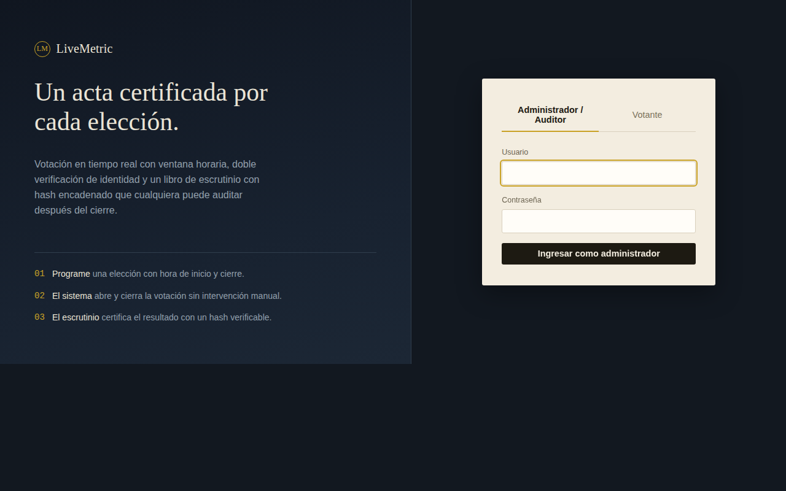
*Captura 01. La pantalla de ingreso, con sus dos pestañas: Administrador / Auditor y Votante.*

---

## 2. Los tres tipos de usuario

| Rol | Cómo entra | Qué puede hacer |
|---|---|---|
| **Administrador** | usuario + contraseña | Todo: crear plantillas y elecciones, cargar el padrón, generar PINes, crear usuarios, consultar resultados, escrutinio y auditoría |
| **Auditor** | usuario + contraseña | **Solo lectura**: consultar resultados y reportes. No puede modificar nada |
| **Votante** | cédula + PIN de acceso | Ver las elecciones abiertas, emitir su voto y consultar su historial |

El rol de **Auditor** existe para que alguien pueda supervisar el proceso sin tener
capacidad de alterarlo. Es la aplicación del principio de mínimo privilegio: quien
verifica no necesita poder modificar.

---

## 3. Ingreso al sistema

La pantalla de inicio tiene dos pestañas. Elija la que corresponda a su rol.

### 3.1 Administrador o Auditor

1. Pestaña **Administrador**.
2. Escriba su **Usuario** y **Contraseña**.
3. Botón **Ingresar como administrador**.

El sistema lo lleva al panel que corresponde a su rol: los administradores ven nueve
pestañas; los auditores, solo dos.


*Captura 02. Ingreso de administrador: el usuario escrito y la contraseña oculta.*

### 3.2 Votante

1. Pestaña **Votante**.
2. Escriba su número de **Cédula**.
3. Escriba su **PIN de acceso**, que le entrega el encargado de su puesto de votación.
4. Botón **Ingresar a votar**.

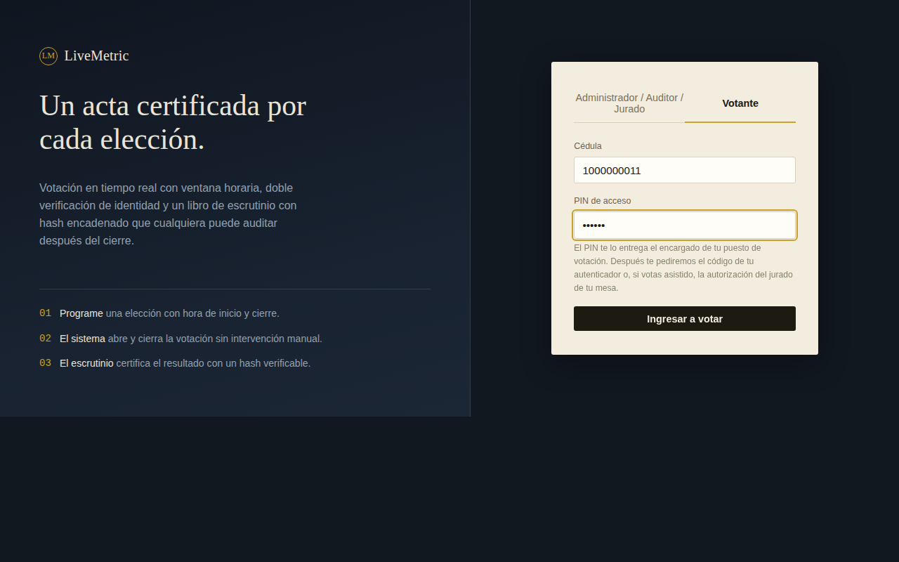
*Captura 03. Ingreso de votante: cédula, PIN de acceso y el texto de ayuda sobre el PIN.*

**Si el ingreso falla**, el sistema siempre responde lo mismo: *"Cédula o PIN
incorrectos"*. No distingue entre una cédula que no existe y un PIN equivocado. Esto es
intencional: evita que alguien pueda averiguar quién está inscrito en el padrón probando
números de cédula.

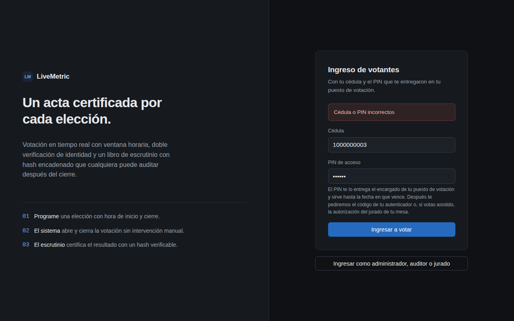
*Captura 04. Un intento fallido: el mensaje es el mismo si la cédula no existe o si el PIN es incorrecto.*

**La sesión del votante dura 10 minutos.** Es tiempo suficiente para votar, y limita el
riesgo si alguien deja la sesión abierta en un equipo compartido. Además, recargar la
página cierra la sesión: en un puesto de votación el equipo pasa de mano en mano, y
dejar la sesión guardada en el navegador sería un riesgo.

---

## 4. Guía del Administrador

El panel de administración tiene nueve pestañas.

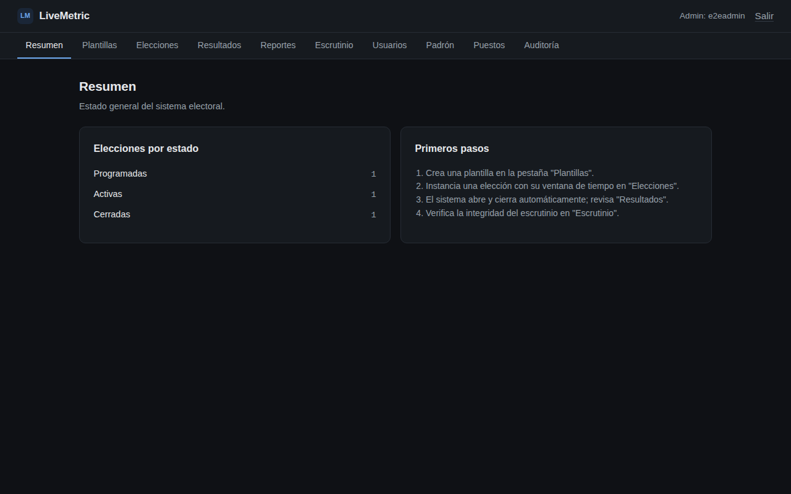
*Captura 05. El panel del administrador, con sus nueve pestañas y Resumen activa.*

### 4.1 Resumen

Muestra el estado general del sistema: cuántas elecciones hay **Programadas**, **Activas**
y **Cerradas**, más una guía de primeros pasos.

Es la pantalla de control: de un vistazo se sabe si hay una votación en curso.

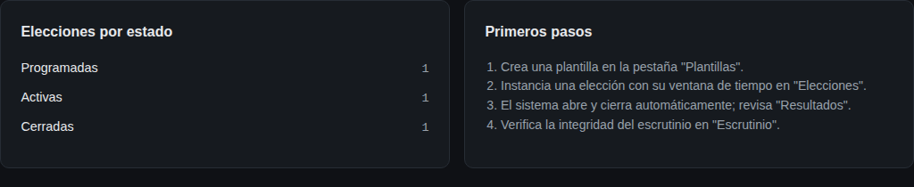
*Captura 06. Resumen: una elección programada, una activa y una cerrada.*

### 4.2 Plantillas

Una **plantilla** es el modelo reutilizable de una votación: define qué se pregunta y
cuáles son las opciones. Se crea una vez y sirve para muchas elecciones.

Para crear una:

1. Pestaña **Plantillas** → **Nueva plantilla**.
2. Escriba el **Nombre** (por ejemplo, *Elección Presidencial 2026*).
3. Opcionalmente, una **Descripción**.
4. En **Candidatos**, agregue cada opción con su **número**, **nombre** y, si desea, un
   **logo o foto**.
5. Use **Quitar** para eliminar una fila que sobre.
6. Guarde la plantilla.

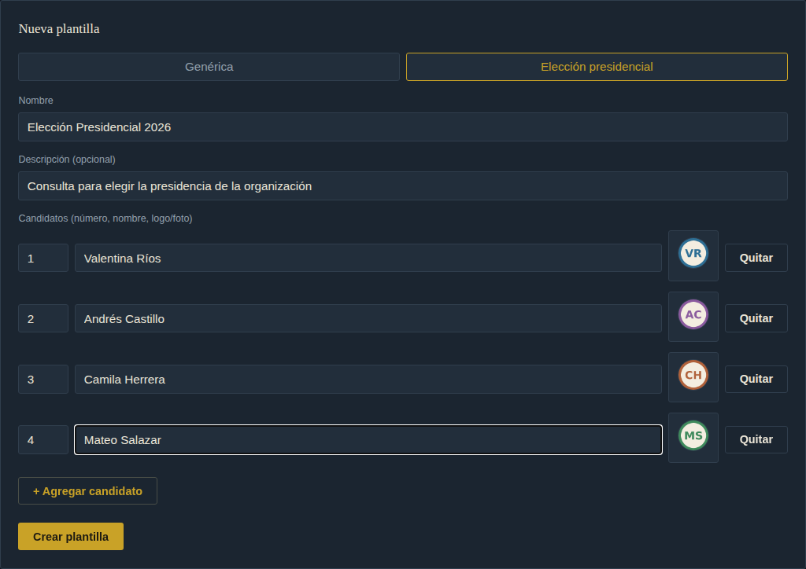
*Captura 07. Nueva plantilla presidencial con cuatro candidatos: número, nombre y foto.*

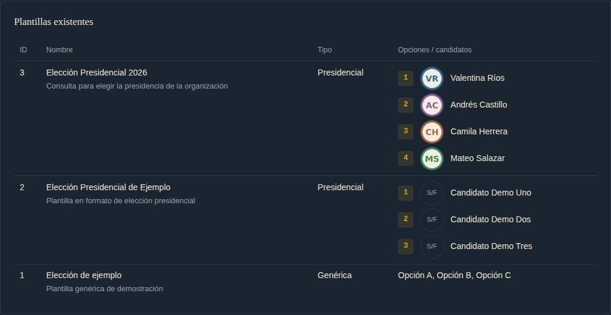
*Captura 08. Las plantillas existentes, con sus candidatos u opciones.*

### 4.3 Elecciones

Aquí se **instancia** una plantilla: se convierte el modelo en una votación real con
fecha y hora.

1. Pestaña **Elecciones** → **Nueva elección**.
2. Elija la **Plantilla** en el desplegable.
3. Escriba el **Título de la elección**.
4. Defina **Apertura** y **Cierre** (fecha y hora).
5. Botón **Programar elección**.

La elección queda en estado **Programada**. **No hay que abrirla ni cerrarla a mano**: el
sistema la abre sola al llegar la hora de apertura y la cierra sola al vencer la de
cierre. Un componente interno revisa esto de forma continua.

Si necesita terminar una votación antes de tiempo, use **Detener** sobre una elección
activa.

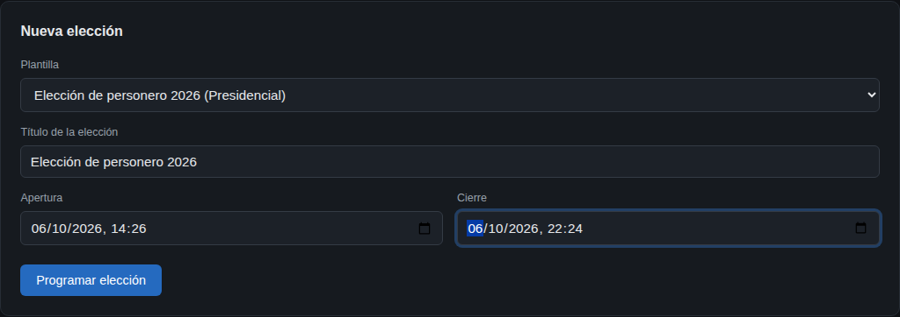
*Captura 09. Nueva elección: plantilla, título y ventana de apertura y cierre.*

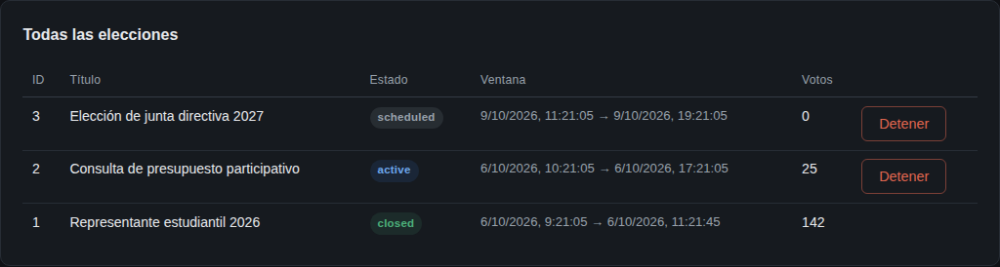
*Captura 10. Las elecciones en sus tres estados: programada, activa y cerrada.*

### 4.4 Padrón

El **padrón** es la lista de quiénes tienen derecho a votar. Sin estar en el padrón, una
persona no puede ingresar.

**Cargar votantes:**

1. Pestaña **Padrón**.
2. En **Votantes a cargar**, pegue la lista con los datos de cada persona (cédula,
   nombre, puesto de votación y mesa).
3. Botón **Cargar al padrón**.

**Generar los PINes:**

Cada votante necesita un **PIN de acceso** para poder ingresar. Se generan desde esta
misma pestaña, en la sección **PIN de acceso generados**.

> ⚠️ **Importante:** el PIN se muestra **una sola vez**, en el momento de generarlo.
> Después el sistema solo guarda una versión cifrada que no se puede revertir. Guarde o
> imprima los PINes en ese momento; si se pierde uno, hay que generarlo de nuevo para esa
> persona.

Si un votante pierde su PIN, el administrador se lo regenera desde el listado del padrón.

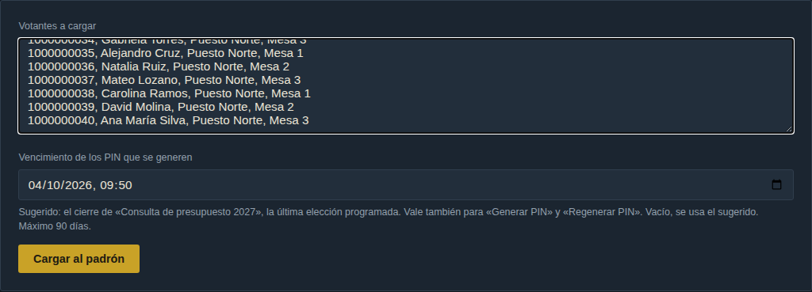
*Captura 11. Carga del padrón: una fila por votante (cédula, nombre, puesto y mesa).*

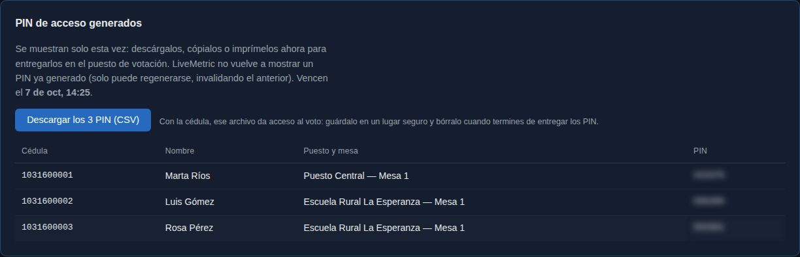
*Captura 12. Los PIN generados, que se muestran una sola vez. En esta captura están difuminados: no deben quedar credenciales en la documentación.*

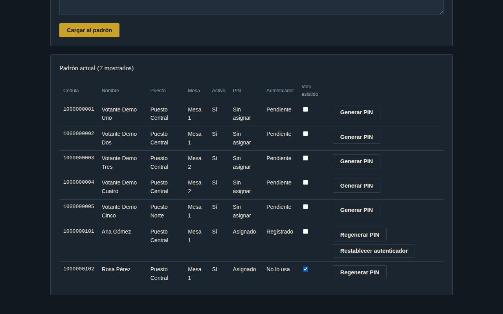
*Captura 13. El padrón actual, con el estado del PIN de cada votante.*

### 4.5 Usuarios

Para crear otros administradores o auditores.

1. Pestaña **Usuarios**.
2. **Usuario** y **Contraseña** (mínimo 10 caracteres).
3. Elija el rol: **Administrador** o **Auditor (solo lectura)**.
4. Botón **Crear usuario**.

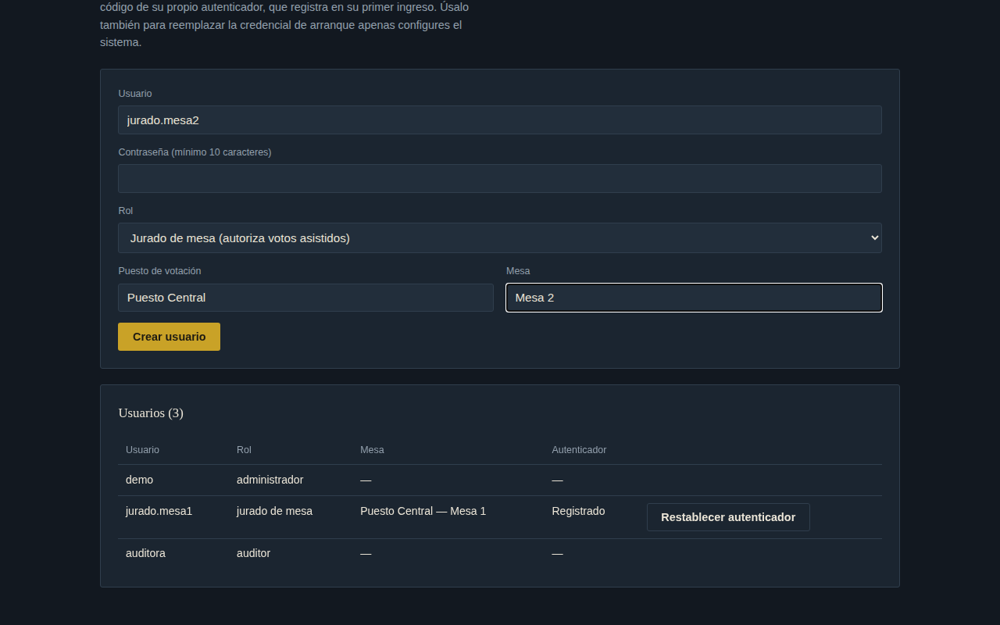
*Captura 14. Creación de un usuario con rol de auditor (solo lectura).*

### 4.6 Resultados

Mientras la votación está abierta, se ve **en vivo solo cuántas personas votaron** (se
actualiza cada 10 segundos). **No se muestran los votos de cada candidato u opción ni quién va
ganando**, a nadie, tampoco al administrador: un resultado parcial podría influir en quien
todavía no votó. El sistema no los entrega antes de tiempo, ni siquiera pidiéndolos
directamente al servicio.

Cuando la elección cierra y el escrutinio certifica el acta (menos de un minuto después), se
publican los **resultados certificados**: votos por opción, ganador y acta por mesa,
encabezados por el **indicador de veracidad del acta**, que se comprueba cada vez que se
consulta:

| Indicador | Qué significa |
|---|---|
| ✓ **Acta verificada** (verde) | La firma digital del acta es válida, su contenido no cambió desde que se certificó y los votos guardados coinciden con ella. Es el único estado confiable. |
| ⚠ **Acta sin firma digital** (dorado) | El acta coincide con la cadena y con los votos, pero se certificó antes de que existiera la firma digital: no se puede probar quién la emitió. |
| ✘ **Acta alterada** (rojo) | Algo no cuadra: se indica qué (la firma no corresponde, el contenido cambió, la cadena se rompió o los votos no coinciden). Esos resultados no deben tomarse como oficiales. |

El administrador puede **descargar el acta en PDF** desde aquí; el documento lleva el
mismo veredicto en su encabezado, comprobado en el momento de generarlo.

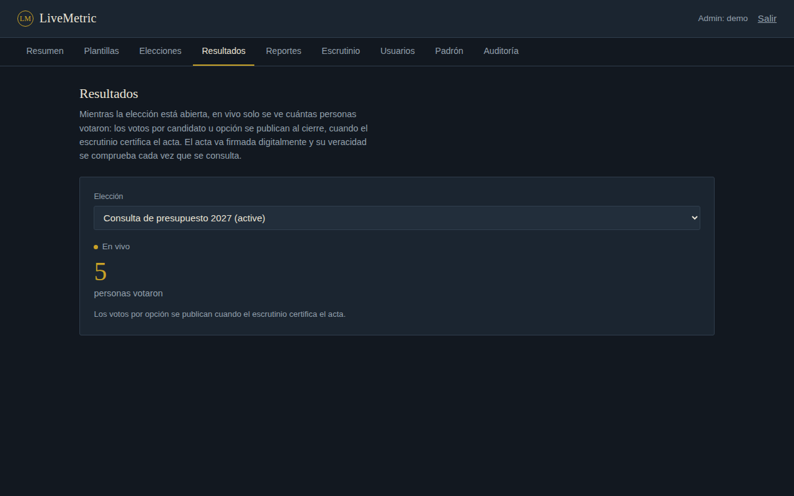
*Captura 15. Una elección activa en Resultados: solo el total de personas que votaron, sin votos por opción.*


*Captura 16. Resultados de una elección cerrada: el indicador "Acta verificada", el ganador y el conteo certificado.*

### 4.7 Reportes

Tableros con estadística avanzada: participación, evolución en el tiempo, proyección de
participación, métricas operativas, de integridad y de accesos sospechosos.

Los tableros se pueden **exportar a PDF**.

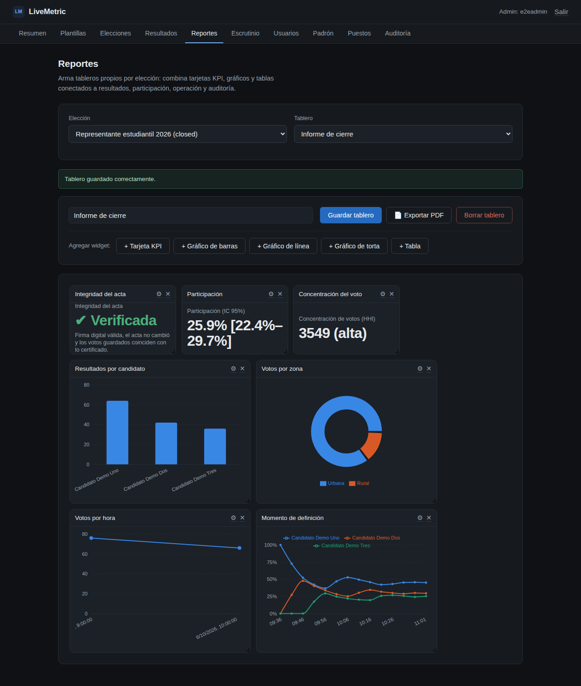
*Captura 17. Un tablero de reportes sobre la elección certificada: integridad del acta, participación, concentración del voto, resultados y evolución.*

### 4.8 Escrutinio

Es la pestaña que diferencia a LiveMetric de un sistema de encuestas cualquiera.

Cuando una elección se cierra, el sistema **recuenta los votos desde cero**, de forma
independiente, genera un **acta con el desglose por mesa de votación** y la sella con una
huella digital (un código llamado *hash*). Cada acta incluye además la huella de la
anterior, formando una **cadena**, y el módulo de escrutinio la **firma digitalmente** con
una clave que solo él tiene.

Esto significa que si alguien alterara un acta, su huella cambiaría y **la cadena se
rompería de forma visible**. Y aunque recalculara todas las huellas, no podría rehacer la
firma: el acta aparecería como alterada igual. No hace falta confiar en el sistema: se
puede comprobar.

Desde esta pestaña (solo administradores) usted puede **verificar las actas**: el sistema
recorre toda la cadena y muestra, acta por acta, si su contenido, su enlace con la
anterior y su firma digital están en orden, con un veredicto (verificada, sin firma o
alterada) y la explicación de cualquier problema.

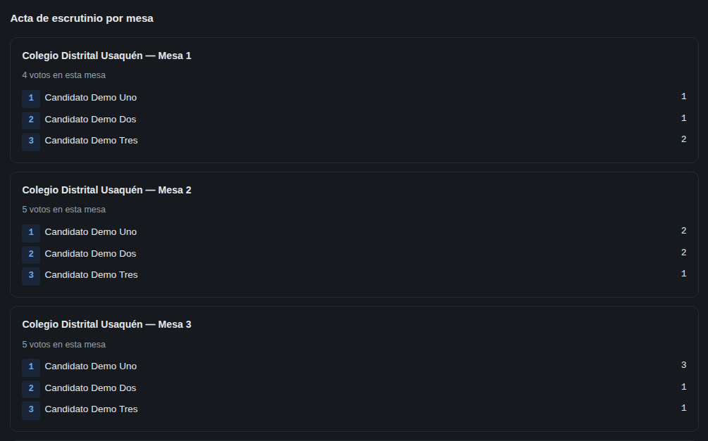
*Captura 18. El acta de escrutinio por mesa, en la pestaña Resultados de una elección certificada.*


*Captura 19. La verificación de todas las actas: contenido, enlace con la anterior y firma digital, con su veredicto.*

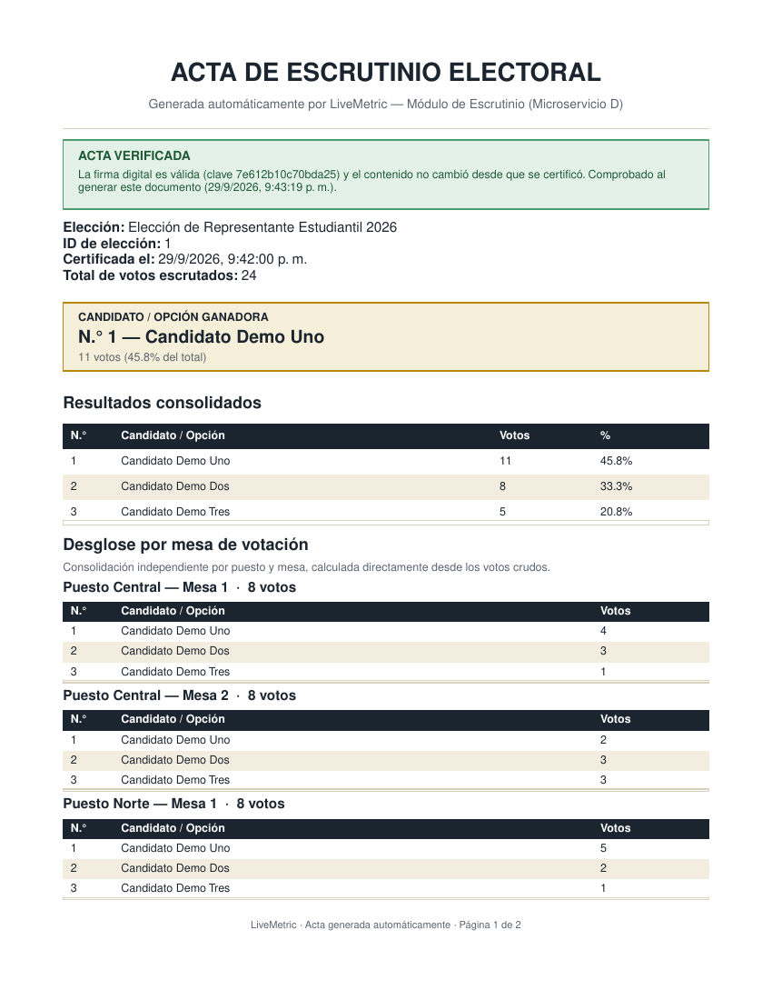
*Captura 20. Primera página del acta en PDF, con el veredicto de verificación en el encabezado.*

### 4.9 Auditoría

Un registro de todo lo que ocurre en el sistema: ingresos exitosos y fallidos, creación
de elecciones, cargas al padrón, certificaciones. Cada evento muestra **Evento**,
**Actor**, **Referencia** y **Fecha**.

Dos características importantes:

- **Es inmutable.** Ni siquiera un administrador puede borrar o modificar un registro. La
  base de datos lo impide a nivel del motor.
- **No guarda cédulas.** A cada persona se la identifica con un código derivado de su
  documento, no con el documento mismo. Así se puede auditar el comportamiento sin
  exponer los datos personales de nadie.

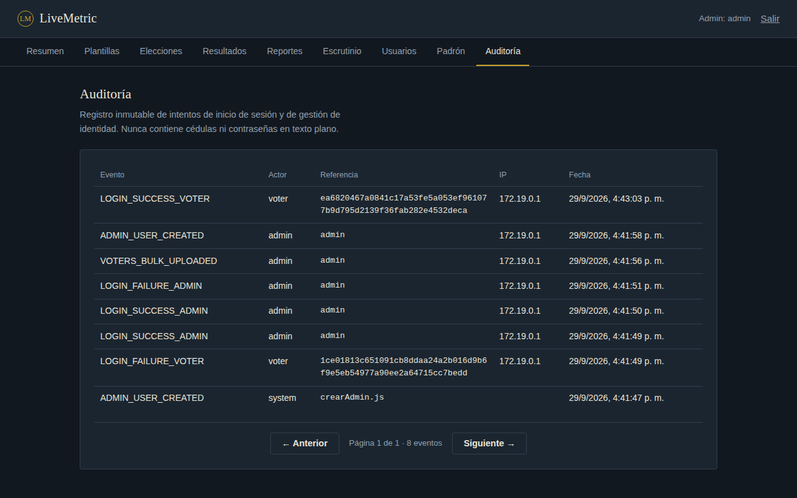
*Captura 21. El registro de auditoría: los votantes aparecen con un código derivado de su cédula, nunca con la cédula.*

---

## 5. Guía del Votante

La experiencia del votante es deliberadamente simple: tres pasos y termina.

### 5.1 Ver las elecciones abiertas

Al ingresar, aparece **Elecciones abiertas ahora**, junto con su **Puesto** y **Mesa**
asignados.

Si no hay ninguna votación en curso, verá el mensaje *"No hay elecciones activas en este
momento. Vuelve más tarde."*

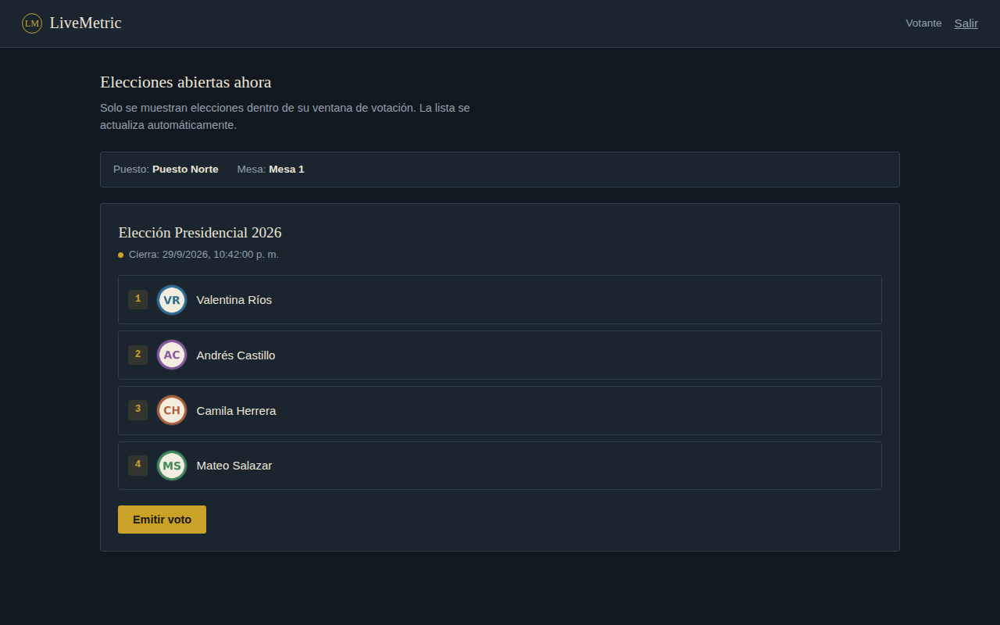
*Captura 22. El votante ve la elección abierta y su puesto y mesa.*

### 5.2 Emitir el voto

1. Revise las opciones: cada candidato aparece con su número, nombre y foto.
2. Seleccione su opción.
3. Confirme.

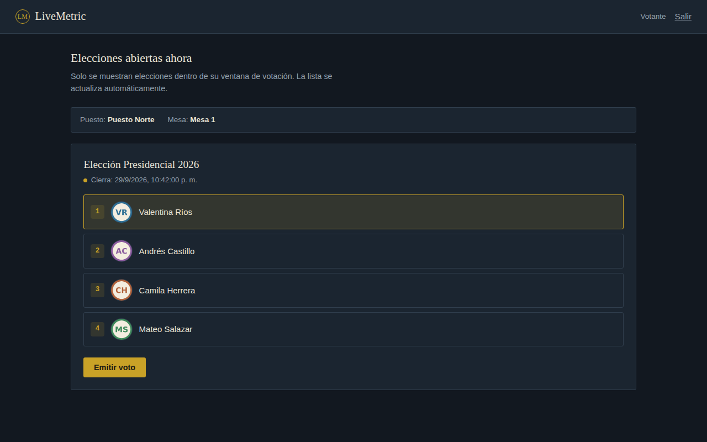
*Captura 23. La boleta con un candidato seleccionado, antes de emitir el voto.*

Al confirmar, aparece la pantalla **Voto registrado**.

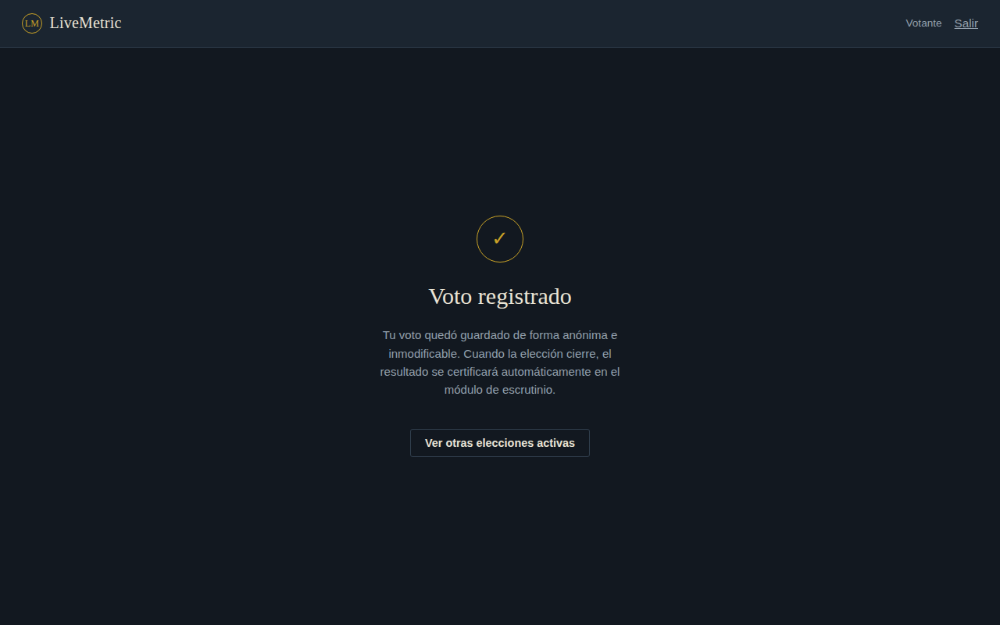
*Captura 24. La confirmación de voto registrado.*

### 5.3 Historial

Abajo aparece **Historial de tus votos**: en qué elecciones ya participó. No muestra **por
quién** votó — eso el sistema no lo revela a nadie —, solo que el voto fue emitido.

Si intenta votar dos veces en la misma elección, verá *"Ya emitiste tu voto en esta
elección"* y la opción quedará bloqueada. El sistema lo impide por tres vías distintas y
simultáneas, de modo que ni un fallo ni una manipulación pueden burlarlo.

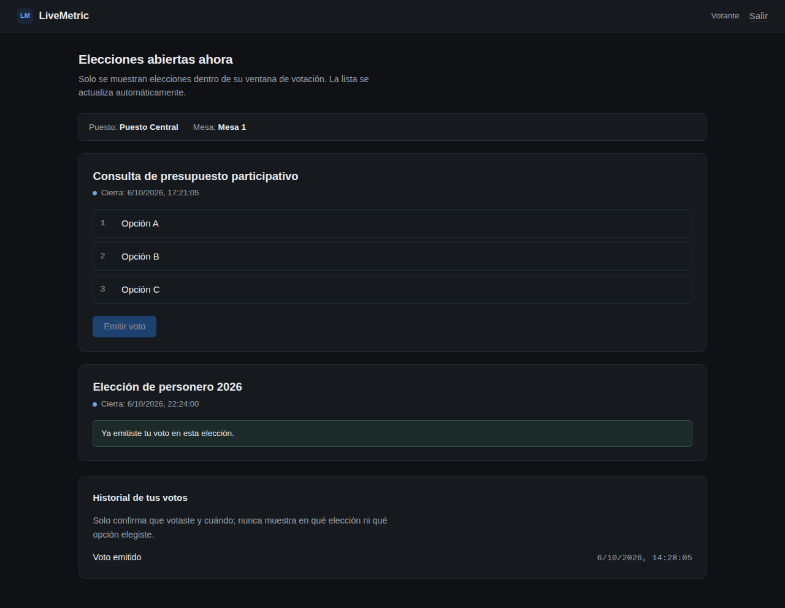
*Captura 25. Después de votar: el aviso "Ya emitiste tu voto en esta elección" y el historial, que no muestra la opción elegida.*

### 5.4 Salir

Botón **Salir**, arriba a la derecha. En un puesto de votación compartido, es importante
hacerlo siempre antes de ceder el equipo al siguiente votante.

---

## 6. Guía del Auditor

El auditor entra por la misma pestaña que el administrador, pero su panel tiene solo dos
secciones: **Resultados** y **Reportes**.

No puede crear elecciones, ni cargar el padrón, ni crear usuarios. Esas opciones
sencillamente no aparecen: la restricción no es que los botones estén ocultos, es que el
servidor rechaza cualquier intento de usar esas funciones con una sesión de auditor.

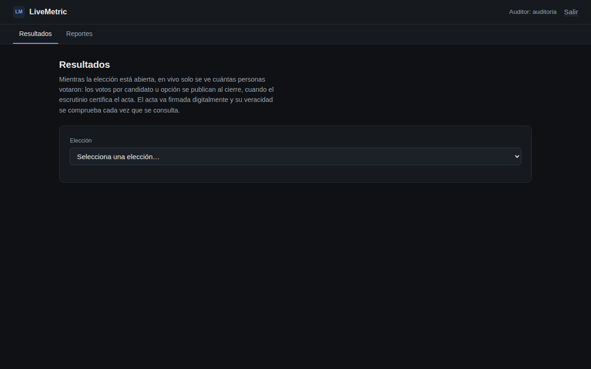
*Captura 26. El panel del auditor: solo dos pestañas, frente a las nueve del administrador (Captura 05).*

---

## 7. Ciclo completo de una elección

Resumen del recorrido de punta a punta:

| # | Paso | Quién | Dónde |
|---|---|---|---|
| 1 | Crear la plantilla con los candidatos | Administrador | Plantillas |
| 2 | Cargar el padrón de votantes | Administrador | Padrón |
| 3 | Generar y entregar los PINes | Administrador | Padrón |
| 4 | Programar la elección con su ventana horaria | Administrador | Elecciones |
| 5 | **Apertura automática** al llegar la hora | Sistema | — |
| 6 | Ingresar y votar | Votantes | Vista de votante |
| 7 | Seguir en vivo cuántas personas votaron | Administrador / Auditor | Resultados |
| 8 | **Cierre automático** al vencer la hora | Sistema | — |
| 9 | **Recuento y certificación automáticos** | Sistema | — |
| 10 | Revisar el indicador de veracidad del acta | Administrador / Auditor | Resultados |
| 11 | Verificar todas las actas y descargar el acta en PDF | Administrador | Escrutinio / Resultados |

Los pasos 5, 8 y 9 no requieren intervención humana. Que la certificación ocurra sola, y
que ningún usuario pueda dispararla, es parte del diseño: el resultado no depende de que
alguien decida cuándo generarlo.

---

## 8. Preguntas frecuentes

**¿Puedo cambiar mi voto después de emitirlo?**
No. Una vez confirmado, el voto es definitivo.

**Perdí mi PIN, ¿qué hago?**
Pídale al administrador que le genere uno nuevo desde la pestaña Padrón.

**¿El sistema sabe por quién voté?**
El voto queda asociado a su mesa de votación, no a usted. El sistema registra que usted
votó — para impedir que vote dos veces — pero no vincula su identidad con la opción
elegida.

**Me salió "Cédula o PIN incorrectos" y estoy seguro de que están bien.**
Puede haber tres causas: la cédula no está en el padrón, el PIN es incorrecto, o su
registro todavía no tiene PIN asignado. El mensaje es el mismo en los tres casos por
seguridad. Consulte con el encargado del puesto.

**Se me cerró la sesión mientras votaba.**
La sesión del votante dura 10 minutos y se cierra al recargar la página. Vuelva a
ingresar con su cédula y PIN; si no alcanzó a confirmar, su voto no quedó registrado y
puede emitirlo de nuevo.

**¿Cómo sé que los resultados no fueron alterados?**
Mire el indicador de veracidad en **Resultados**: solo "✓ Acta verificada" garantiza que
el acta tiene la firma digital del módulo de escrutinio, que no cambió y que coincide con
los votos guardados. El administrador puede además usar **Verificar actas** en la pestaña
Escrutinio, que revisa todas las actas y señala exactamente cuál y qué falló.

---

## Anexo — Lista de capturas

Las capturas están en `docs/img/`. Se tomaron con los datos de demostración (padrón,
candidatos y votos ficticios) sobre una instalación limpia, con el navegador a 1280 px de
ancho. Ninguna muestra credenciales: la contraseña aparece oculta y los PIN, difuminados.

| # | Archivo | Contenido |
|---|---|---|
| 01 | `01-pantalla-inicio.png` | Pantalla de ingreso |
| 02 | `02-login-admin.png` | Ingreso de administrador |
| 03 | `03-login-votante.png` | Ingreso de votante |
| 04 | `04-login-fallido.png` | Error genérico de credenciales |
| 05 | `05-panel-admin.png` | Panel de administrador (9 pestañas) |
| 06 | `06-resumen.png` | Pestaña Resumen |
| 07 | `07-plantilla-nueva.png` | Formulario de plantilla |
| 08 | `08-plantillas-lista.png` | Listado de plantillas |
| 09 | `09-eleccion-programar.png` | Programar elección |
| 10 | `10-elecciones-lista.png` | Listado de elecciones |
| 11 | `11-padron-carga.png` | Carga del padrón |
| 12 | `12-padron-pines.png` | PINes generados (difuminados) |
| 13 | `13-padron-lista.png` | Listado del padrón |
| 14 | `14-usuarios.png` | Creación de usuarios y roles |
| 15 | `15-resultados-vivo.png` | Total en vivo (sin votos por opción) |
| 16 | `16-resultados-certificados.png` | Resultados certificados |
| 17 | `17-reportes.png` | Tablero de reportes |
| 18 | `18-escrutinio-actas.png` | Acta por mesa (Resultados) |
| 19 | `19-escrutinio-verificacion.png` | Verificación de las actas |
| 20 | `20-acta-pdf.png` | Acta en PDF |
| 21 | `21-auditoria.png` | Registro de auditoría |
| 22 | `22-votante-elecciones.png` | Elecciones abiertas |
| 23 | `23-votante-boleta.png` | Boleta de votación |
| 24 | `24-voto-registrado.png` | Confirmación de voto |
| 25 | `25-votante-historial.png` | Historial y bloqueo de doble voto |
| 26 | `26-panel-auditor.png` | Panel de auditor (2 pestañas) |

Las capturas 05 y 26 juntas muestran el control de acceso por rol: conviene usarlas también
en el informe y en el video.
